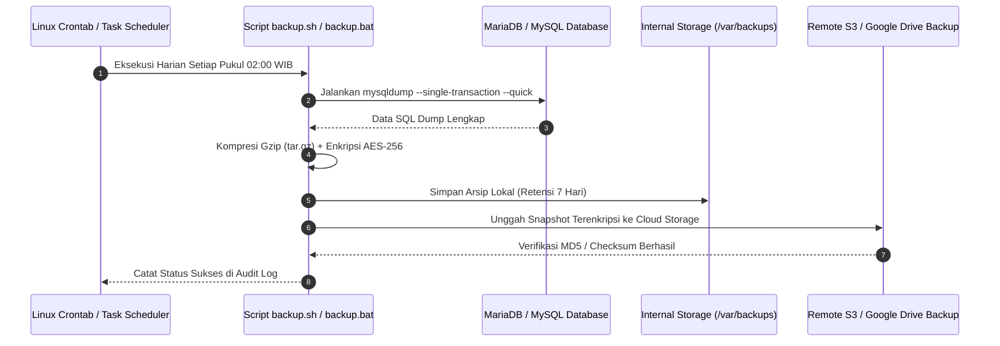

# 💾 Automated Backup Strategy - Strategi Pencadangan Otomatis

Dokumen ini mendokumentasikan prosedur pencadangan otomatis (*automated backup*) database transaksi dan aset sistem UMKM Bu Inem untuk mencegah kehilangan data berharga.

---

## 1. Topologi & Alur Backup Otomatis



---

## 2. Parameter Perintah Backup Aman

```bash
mysqldump -u ${DB_USER} -p${DB_PASSWORD} \
  --host=${DB_HOST} \
  --port=${DB_PORT} \
  --single-transaction \
  --quick \
  --lock-tables=false \
  --routines \
  --triggers \
  ${DB_NAME} | gzip -9 > /backup/pos_bu_inem_$(date +%Y%m%d_%H%M%S).sql.gz
```

Klausa `--single-transaction` memastikan operasional kasir tidak terkunci (*no lock*) saat proses pencadangan berlangsung di latar belakang.
