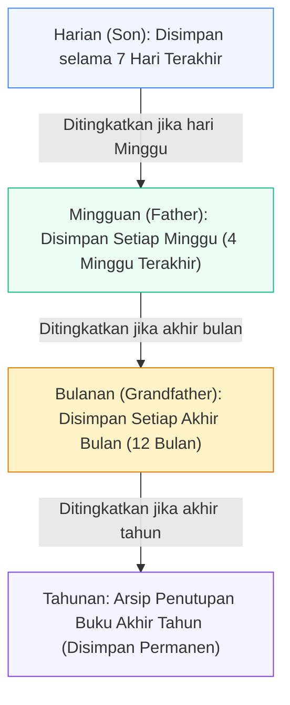

# 📅 Snapshot Retention Policy - Kebijakan Retensi Arsip Data

Dokumen ini mendefinisikan jadwal rotasi dan retensi arsip snapshot data (*Grandfather-Father-Son rotation*) agar ruang penyimpanan disk server tetap optimal dan terkendali.

---

## 1. Siklus Rotasi Retensi (GFS Retention Scheme)



---

## 2. Aturan Pembersihan Disk Otomatis

Script pembersih disk dijalankan berkala untuk menghapus file snapshot yang telah melewati batas kedaluwarsa:
```bash
# Hapus backup harian yang berumur lebih dari 7 hari
find /backup/daily -type f -name "*.sql.gz" -mtime +7 -delete

# Hapus backup mingguan yang berumur lebih dari 30 hari
find /backup/weekly -type f -name "*.sql.gz" -mtime +30 -delete
```
