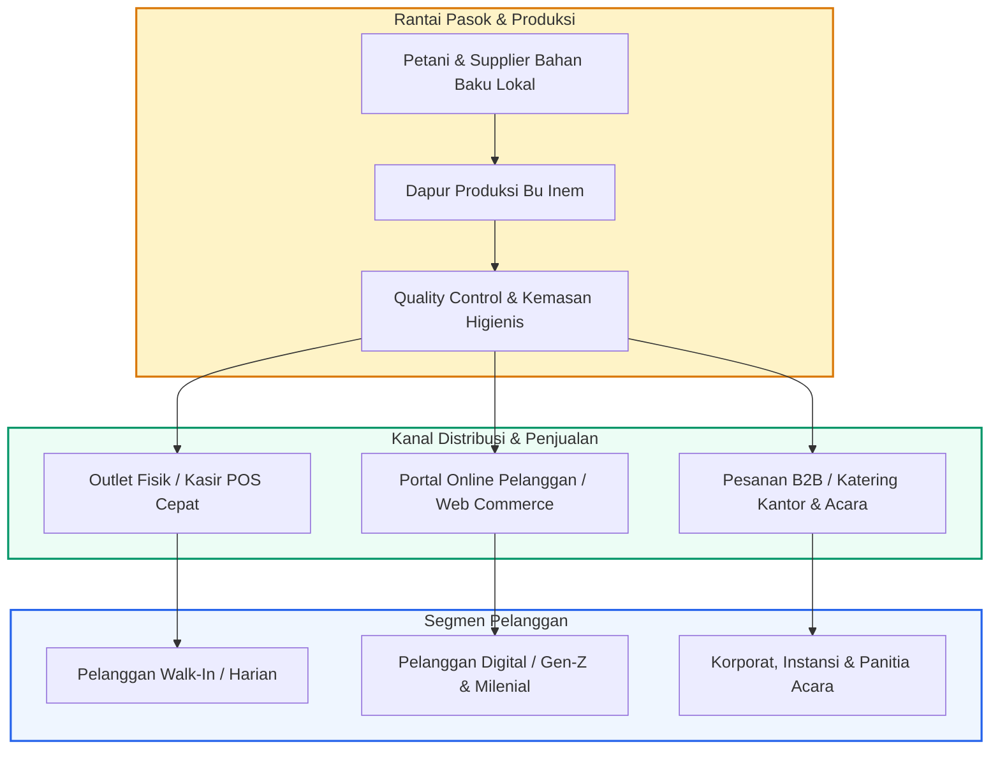
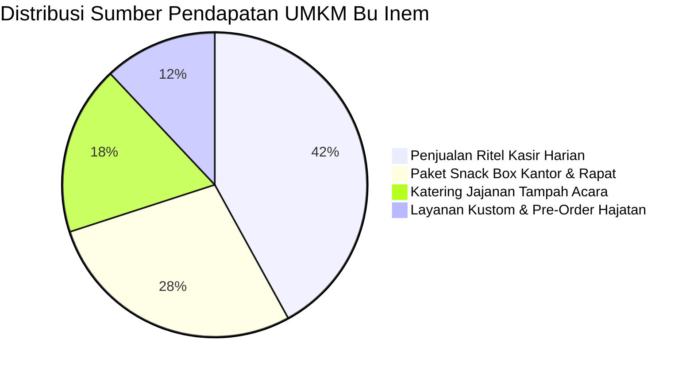
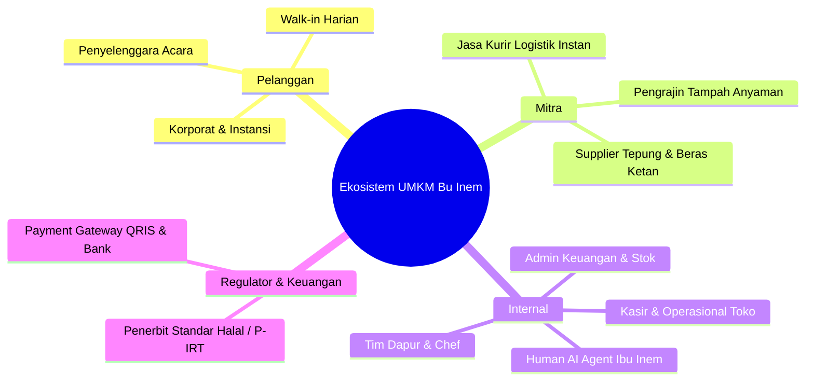

# 🏢 Business Overview - UMKM Jajanan Bu Inem

Dokumen ini menjelaskan model bisnis holistik, ekosistem operasional, dan transformasi digital UMKM Jajanan Tradisional Ibu Inem dari sistem manual tradisional menuju platform Point of Sale (POS), CRM, dan Automated Commerce terintegrasi.

---

## 1. Profil & Model Bisnis

UMKM Jajanan Bu Inem bergerak dalam produksi dan distribusi kuliner tradisional khas nusantara (lemper, pastel, lumpia basah, risol mayo, klepon, nagasari, kue lapis) dan layanan pemesanan paket jajanan pasar tampah, snack box kantor, serta katering hajatan.

---

## 2. Peta Arus Pendapatan (Revenue Streams)

1. **Ritel Harian (Direct Walk-in)**: Penjualan produk satuan siap saji di toko fisik dengan perputaran kas cepat melalui kasir offline/online.
2. **Paket Snack Box Instansi**: Pemesanan terjadwal (B2B) untuk instansi pemerintah, sekolah, dan perkantoran.
3. **Katering Jajanan Tampah Tradisional**: Produk premium untuk acara adat, syukuran, dan pernikahan dengan margin keuntungan lebih tinggi.
4. **Layanan Kustom**: Pemesanan rasa, kemasan hias, dan ukuran khusus sesuai permintaan pelanggan.

---

## 3. Matriks Ekosistem Nilai & Stakeholder

---

## 4. Indikator Kinerja Utama (KPI Bisnis)

| Matrik KPI | Target 2026 | Strategi Pencapaian |
| :--- | :--- | :--- |
| **Kecepatan Transaksi Kasir** | < 15 detik/transaksi | Quick-cart scanner, offline-first PWA, shortcut keyboard POS |
| **Akurasi Stok Bahan & Produk** | > 99.2% | Validasi stok otomatis, alert low-stock realtime di dashboard |
| **Konversi Pengunjung Web ke Order** | > 12.5% | Human Agent AI interaktif, checkout tanpa repot akun, QRIS instan |
| **Kepuasan Pelanggan (CSAT)** | 4.85 / 5.0 | Layanan human agent hangat & ramah, nota struk termal 58mm resmi |
| **Lama Respons Pelanggan** | < 3 detik | Integrasi Groq LLaMA 3.3 Graph RAG 24/7 |
