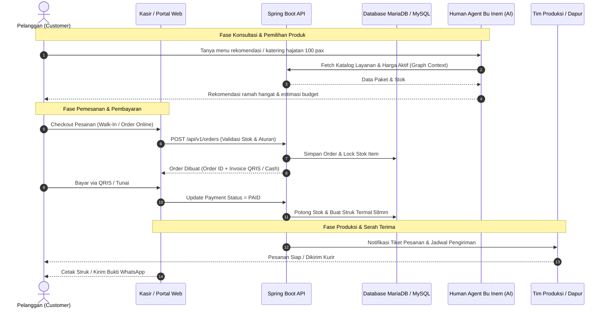
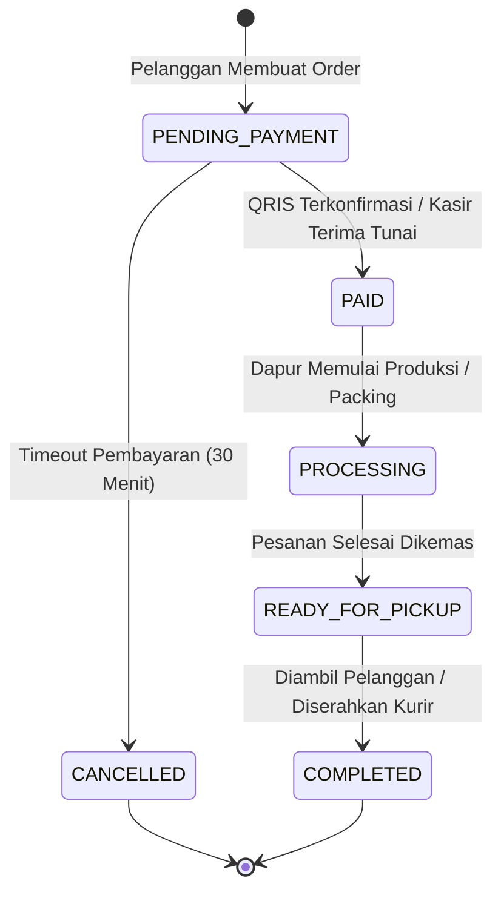
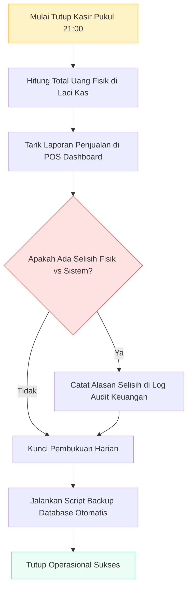

# 🔄 Alur Operasional Bisnis (Operational Workflow)

Dokumen ini mendeskripsikan siklus lengkap operasional harian UMKM Bu Inem, mulai dari persiapan bahan, penjualan kasir harian, penanganan pesanan katering, hingga rekonsiliasi keuangan penutupan hari.

---

## 1. Siklus Operasional Harian Lengkap

---

## 2. Alur Pengelolaan Pesanan & State Machine

---

## 3. Rekonsiliasi & Penutupan Kasir (End of Day)

