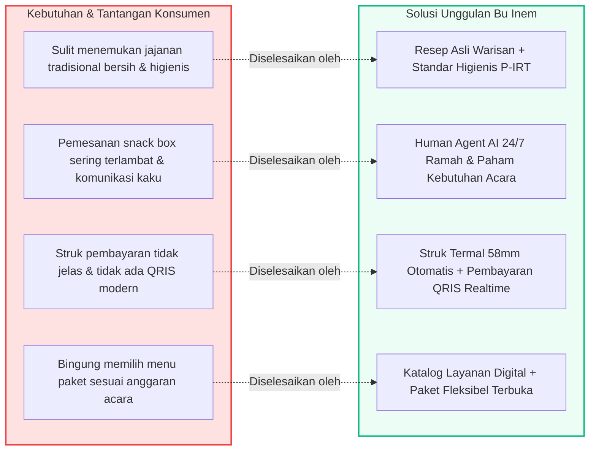
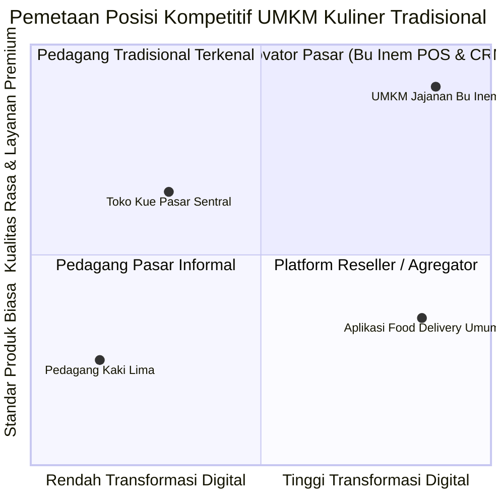

# 🌟 Value Proposition & Keunggulan Kompetitif

Dokumen ini memetakan proposisi nilai (*Value Proposition Canvas*) produk dan layanan UMKM Jajanan Bu Inem dibandingkan kompetitor konvensional.

---

## 1. Value Proposition Canvas

---

## 2. Diferensiasi Kompetitif

---

## 3. Komitmen Pelayanan (Service Commitments)

1. **Rasa Otentik & Bahan Segar**: Diproduksi setiap dini hari dengan kelapa asli, santan murni, dan tanpa bahan pengawet berbahaya.
2. **Kecepatan & Kehangatan**: Interaksi ramah dari tim kasir hingga Human Agent Bu Inem yang siap mendengarkan preferensi pelanggan.
3. **Transparansi Transaksi**: Setiap pesanan memiliki nomor pelacakan unik, rincian biaya transparan tanpa markup tersembunyi.
