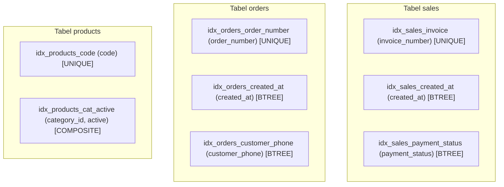

# ⚡ Indexing & Performance Optimization

Dokumen ini mendokumentasikan strategi pengindeksan database MariaDB/MySQL untuk menjamin kueri kasir POS tetap di bawah 10ms meskipun jumlah data transaksi terus bertumbuh.

---

## 1. Peta Indeks B-Tree Kunci

---

## 2. Optimasi Query & Execution Plan

1. **Composite Indexing untuk Filter Kasir**:
   - `CREATE INDEX idx_products_cat_active ON products(category_id, active);`
   - Memungkinkan dropdown kategori di kasir langsung menggunakan index range scan tanpa table scan penuh (*Using index condition*).
2. **Kueri Pagination Terbatas**:
   - Menggunakan klausa `LIMIT ? OFFSET ?` dengan order primary key terindeks untuk mencegah memory sort buffer overflow.
3. **Penyimpanan JSON Features**:
   - Kolom `features` pada `service_products` disimpan dalam format JSON ringan tanpa tabel relasi berlebih, mengurangi jumlah `JOIN` yang tidak perlu.
