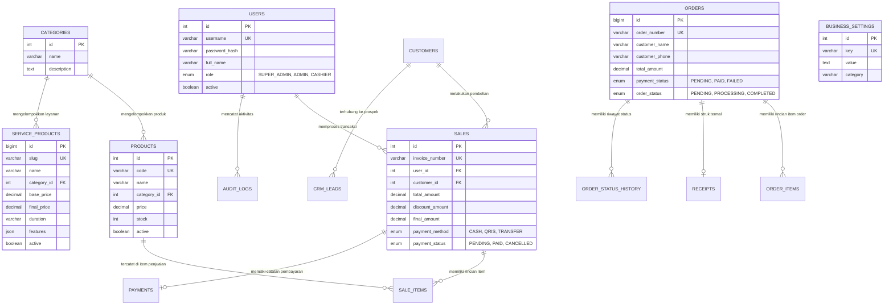

# 🗄️ Relational Schema & Entity Relationship Diagram (ERD)

Dokumen ini menyajikan model data konseptual dan relasional lengkap dari sistem database POS, CRM, dan Order Commerce UMKM Jajanan Bu Inem.

---

## 1. Entity Relationship Diagram (ERD) Lengkap

---

## 2. Struktur Normalisasi Data

1. **Bentuk Normal Ketiga (3NF)**: Setiap atribut non-kunci bergantung secara fungsional penuh pada primary key masing-masing tabel tanpa dependensi transitif.
2. **Snapshot Harga Historis**: Tabel `sale_items` dan `order_items` menduplikasi `price_at_sale` untuk mencegah perubahan harga di master produk mengubah laporan keuangan masa lalu.
