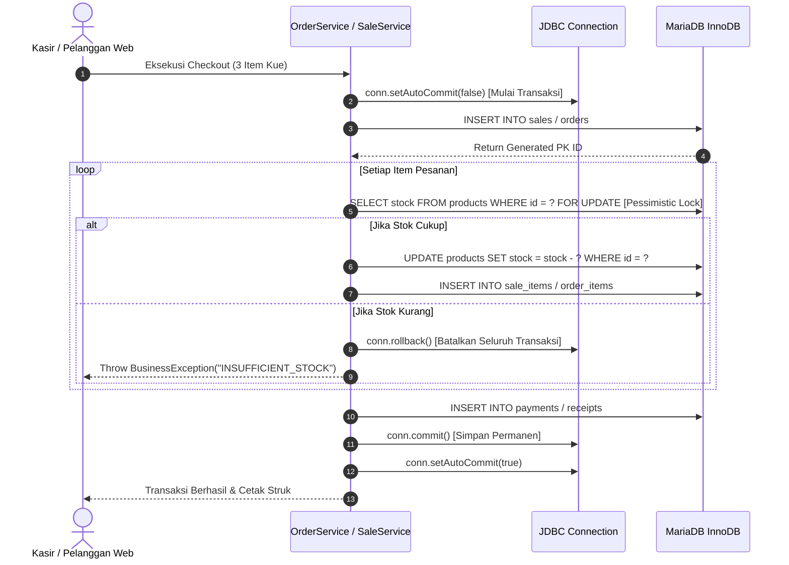

# 🔒 Transaction Management & ACID Guarantees

Dokumen ini mendokumentasikan implementasi transaksi database tingkat kode menggunakan Java JDBC murni untuk menjamin konsistensi data finansial dan stok inventaris.

---

## 1. Alur Transaksi Kasir & Checkout Atomik

---

## 2. Prinsip ACID yang Dijamin

- **Atomicity**: Jika ada satu item yang stoknya mendadak habis atau koneksi terputus di tengah jalan, seluruh transaksi di-rollback tanpa sisa data yatim (*orphan data*).
- **Consistency**: Aturan stok tidak boleh minus (`CHECK (stock >= 0)`) selalu ditegakkan.
- **Isolation**: Tingkat isolasi `READ COMMITTED` mencegah *dirty reads* antar kasir yang melayani bersamaan di jam sibuk.
- **Durability**: Redo log InnoDB memastikan data yang sudah di-commit tidak akan hilang saat terjadi listrik padam mendadak.
