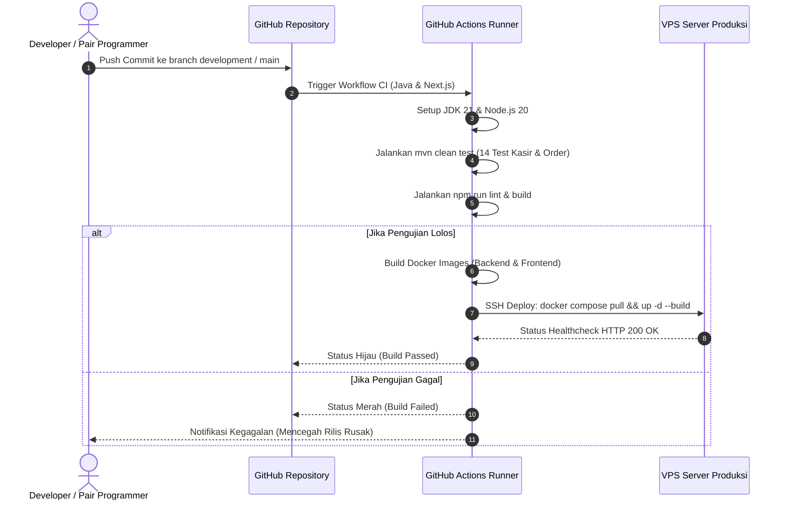

# 🚀 CI/CD Pipeline - Otomasi Pengujian & Rilis

Dokumen ini menjelaskan alur integrasi berkelanjutan (*Continuous Integration*) dan pengiriman otomatis (*Continuous Delivery*) menggunakan GitHub Actions untuk menjamin stabilitas kode.

---

## 1. Alur Pipeline GitHub Actions

---

## 2. Pengecekan Kualitas Otomatis

1. **Backend Unit Testing**: Validasi integritas kalkulasi harga, pemotongan stok `StockValidator`, dan DTO mapper.
2. **TypeScript Strict Checking**: Memastikan tidak ada *type error* atau impor rusak pada komponen UI.
3. **Audit Kepatuhan Keamanan**: Pengecekan celah keamanan dependensi dengan `npm audit` dan OWASP dependency check.
