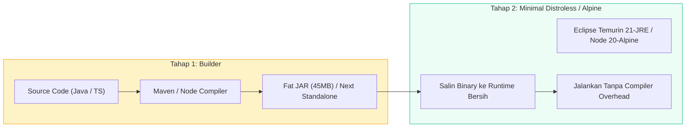

# 🐳 Docker Containerization - Multi-Stage Container Setup

Dokumen ini mendokumentasikan strategi kontainerisasi aplikasi UMKM Bu Inem menggunakan Docker multi-stage build untuk Backend Spring Boot 3 dan Frontend Next.js 16, menghasilkan image yang ramping, aman, dan siap produksi.

---

## 1. Topologi Docker Compose

```mermaid
graph TD
    subgraph HostSystem["Host Server / VPS Linux"]
        Traefik["Reverse Proxy / Nginx SSL (Port 80/443)"]
        
        subgraph DockerNetwork["Internal Docker Network: pos-network"]
            FE_Container["Frontend Container (Next.js 16 - Port 3000)"]
            BE_Container["Backend Container (Spring Boot 3 - Port 8080)"]
            DB_Container["Database Container (MariaDB 10.11 - Port 3306)"]
        end

        DB_Volume[("Docker Volume: mariadb_data")]
    end

    User[Pengguna Internet] --> Traefik
    Traefik -->|/api/*| BE_Container
    Traefik -->|/* (Katalog & POS)| FE_Container
    FE_Container -->|Server Fetch| BE_Container
    BE_Container --> DB_Container
    DB_Container --> DB_Volume

    style DockerNetwork fill:#ecfdf5,stroke:#059669,stroke-width:2px;
    style HostSystem fill:#eff6ff,stroke:#2563eb,stroke-width:2px;
```

---

## 2. Multi-Stage Build Pipeline



---

## 3. Konfigurasi Lingkungan (`.env`)

| Variabel | Deskripsi | Nilai Default Produksi |
| :--- | :--- | :--- |
| `DB_HOST` | Hostname Database di Docker | `mariadb` |
| `DB_PORT` | Port JDBC | `3306` |
| `DB_NAME` | Nama Database POS | `jajanan_ibu_inem_pos` |
| `JWT_SECRET` | Kunci Rahasia Enkripsi Token | String acak base64 minimal 256 bit |
| `GROQ_API_KEY` | Kunci API Groq Cloud | `gsk_...` |
| `NEXT_PUBLIC_API_URL` | Base URL Backend untuk Browser | `https://pos.ibuinem.com` |
