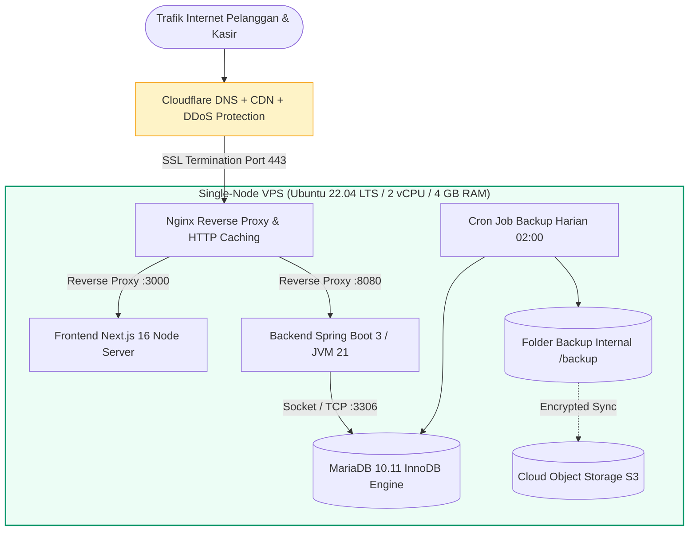

# 🌐 Production Infrastructure - Infrastruktur Skalabel & Hemat Biaya

Dokumen ini mendokumentasikan spesifikasi infrastruktur server fisik/cloud yang dirancang efisien untuk skala UMKM dengan alokasi sumber daya optimal.

---

## 1. Topologi Infrastruktur Produksi

---

## 2. Alokasi Sumber Daya Server (Resource Sizing)

| Layanan | CPU Allocation | RAM Limit | Disk Space | Keterangan |
| :--- | :--- | :--- | :--- | :--- |
| **Spring Boot 3 (JVM)** | 0.8 vCPU | 768 MB (`-Xmx512m`) | 200 MB (App JAR) | Heap size dibatasi agar tidak swap |
| **Next.js 16 (Node.js)** | 0.6 vCPU | 512 MB | 300 MB (Standalone) | SSR & Dynamic Route rendering |
| **MariaDB 10.11** | 0.5 vCPU | 512 MB buffer pool | 10 GB SSD | Penanganan transaksi hingga 100k data |
| **OS & Backup Temp** | 0.1 vCPU | 256 MB | 5 GB SSD | Logging rotasi dan file dump sementara |
| **Total Server Minimum** | **2 vCPU** | **2 GB - 4 GB** | **20 GB NVMe** | Biaya ~$5-$10/bulan (Sangat terjangkau UMKM) |
