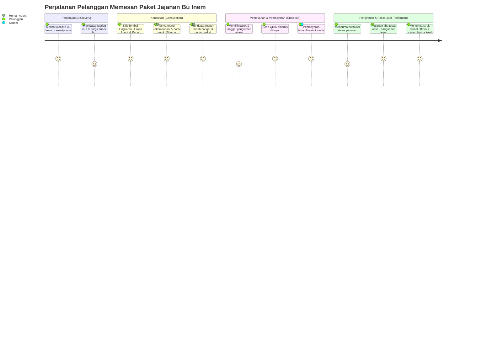
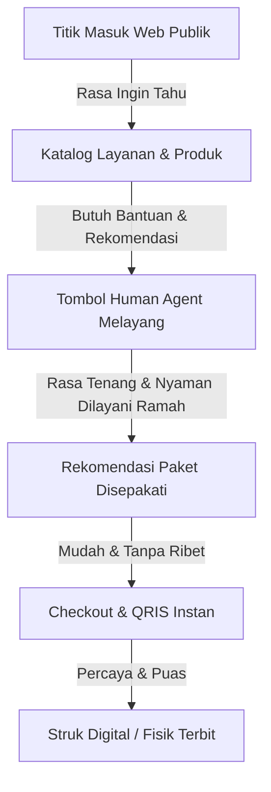

# 🗺️ Customer Journey Map - Pengalaman Pelanggan

Dokumen ini memetakan peta perjalanan pelanggan (*Customer Journey Map*) mulai dari pencarian jajanan, konsultasi dengan Human Agent Bu Inem, pemesanan, pembayaran QRIS, hingga penerimaan pesanan.

---

## 1. Peta Perjalanan Pelanggan (Customer Journey)

---

## 2. Touchpoint & Emosi Pengguna

