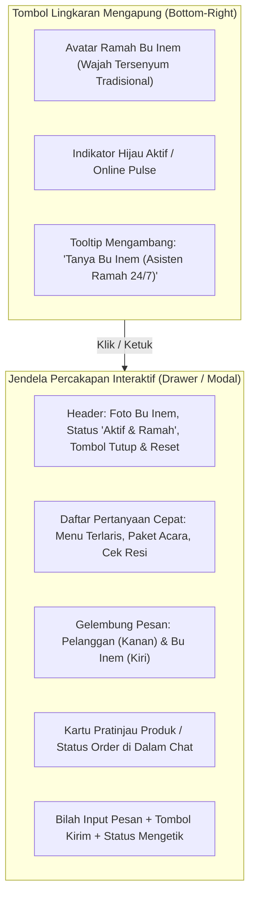
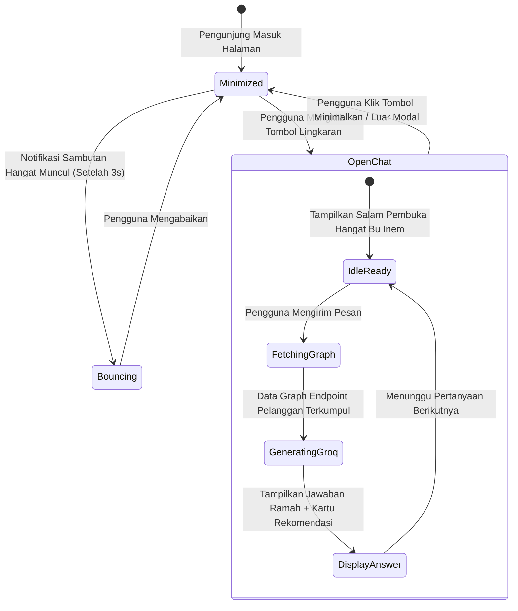

# 🤖 Human Agent Interface Design - Widget Lingkaran Kanan Bawah

Dokumen ini mendefinisikan rancangan antarmuka komponen **Human Agent Floating Circle Button** yang terletak di pojok kanan bawah aplikasi untuk melayani pelanggan secara interaktif, ramah, dan solutif.

---

## 1. Tata Letak & Anatomi Komponen Widget

---

## 2. Diagram State Interaksi Widget

---

## 3. Spesifikasi CSS & Aksesibilitas

- **Posisi Layar**: `fixed bottom-6 right-6 z-50`
- **Ukuran Tombol**: `w-14 h-14 sm:w-16 sm:h-16` (Memenuhi standar touch minimum 48px WCAG 2.1 AA).
- **Efek Visual**: `shadow-2xl shadow-amber-500/30 hover:scale-105 transition-all duration-300 ring-4 ring-amber-400/40`.
- **Dukungan Aksesibilitas**: `aria-label="Buka Chat Asisten Bu Inem"`, `role="dialog"`, dan dukungan penutupan dengan tombol keyboard `Escape`.
