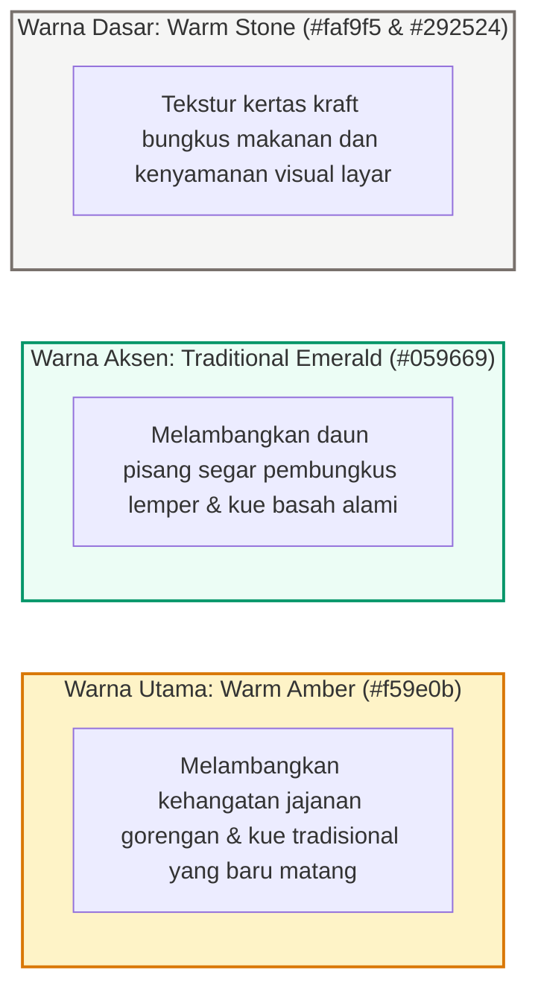
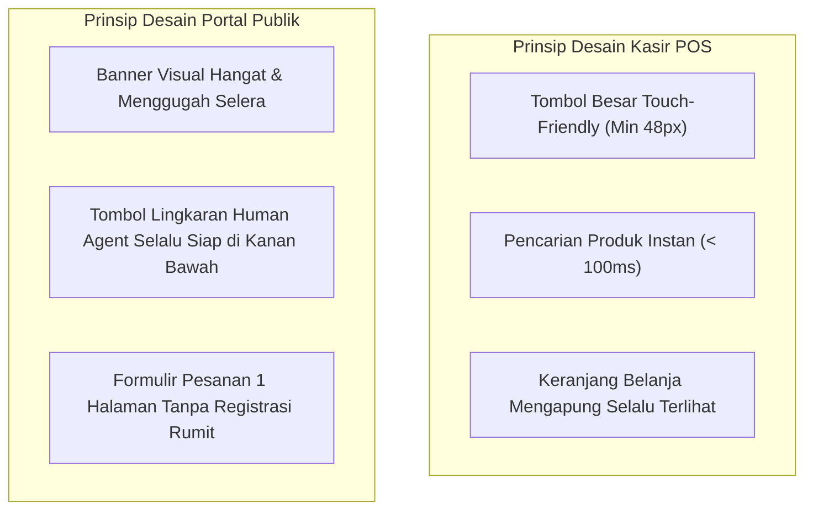

# 🎨 UI/UX Design System - Identitas Visual UMKM Bu Inem

Dokumen ini mendokumentasikan panduan identitas visual, palet warna, tipografi, dan komponen antarmuka yang mencerminkan kearifan lokal kuliner nusantara yang higienis, hangat, dan modern.

---

## 1. Palet Warna & Filosofi Estetika

---

## 2. Tipografi & Hierarki Visual

1. **Heading & Display**: Font `Geist Sans` dan varian bobot 700/800 untuk judul yang tegas dan mudah terbaca kasir dalam jarak pandang 50 cm.
2. **Body & Angka Transaksi**: Tabular numbers dan `Geist Mono` untuk label harga, kuantitas item, serta total nominal Rupiah guna mencegah kesalahan hitung kasir.

---

## 3. Desain Komponen Kasir POS & Portal Publik

