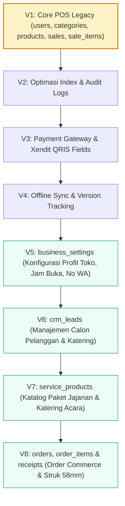
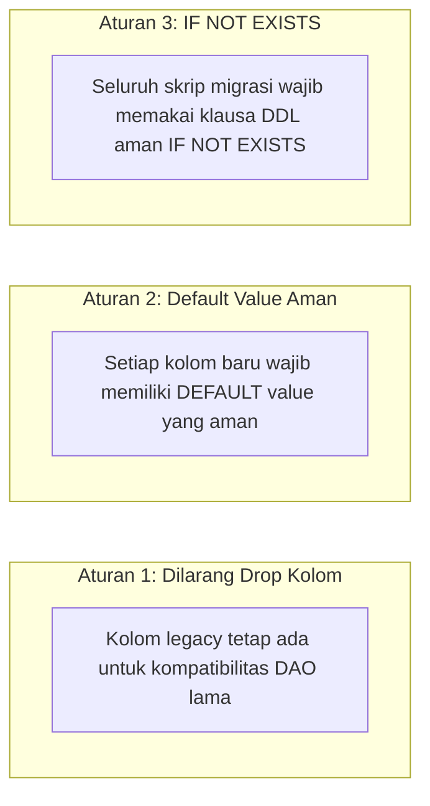

# 🗄️ Strategi Migrasi Database - Zero Downtime & Backward Compatibility

Dokumen ini menjelaskan strategi migrasi database skema relasional UMKM Bu Inem dari versi awal V1 (POS legacy) hingga penambahan modul CRM & Jasa V5-V8 secara aditif tanpa merusak data transaksi eksisting.

---

## 1. Peta Jalur Migrasi Skema (V1 s/d V8)

---

## 2. Prinsip Non-Destruktif (Additive Schema Changes)

---

## 3. Prosedur Rollback & Verifikasi Migrasi

1. **Pre-Migration Backup**: Eksekusi dump skema dan data menggunakan `mysqldump --single-transaction`.
2. **Dry-Run Staging**: Verifikasi skrip SQL pada instance database uji coba.
3. **Execution**: Eksekusi file migrasi terurut (`V5__...sql`, `V6__...sql`, dst.).
4. **Smoke Test Backend**: Menjalankan pengujian otomatis `mvn test` untuk memastikan semua DAO lulus verifikasi 100%.
