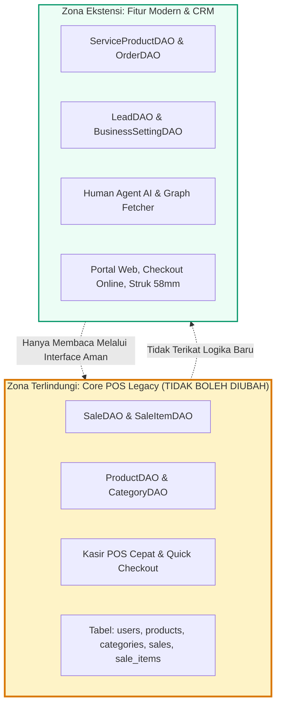

# 🛡️ Legacy Coexistence - Panduan Menjaga Integritas Kode Warisan

Dokumen ini menjabarkan aturan ketat isolasi sistem warisan (*legacy system isolation*) agar penambahan fitur modern (CRM, Public Commerce, Human Agent AI) tidak mengganggu modul kasir POS dasar yang telah stabil.

---

## 1. Pola Strangler Fig Pattern

---

## 2. Prinsip Rekayasa Perangkat Lunak

1. **Anti-Corruption Layer (ACL)**: Setiap konversi data antara format lama dan format baru dilakukan melalui DTO Mapper murni (`ProductMapper`, `OrderMapper`).
2. **Backward Compatibility Testing**: Setiap perubahan diverifikasi dengan test suite komprehensif (`mvn test`) untuk memastikan tidak ada regresi pada fungsionalitas lama.
3. **No Breaking Schema**: Tidak mengubah tipe data, constraint, atau nama kolom pada tabel legacy `sales` dan `products`.
