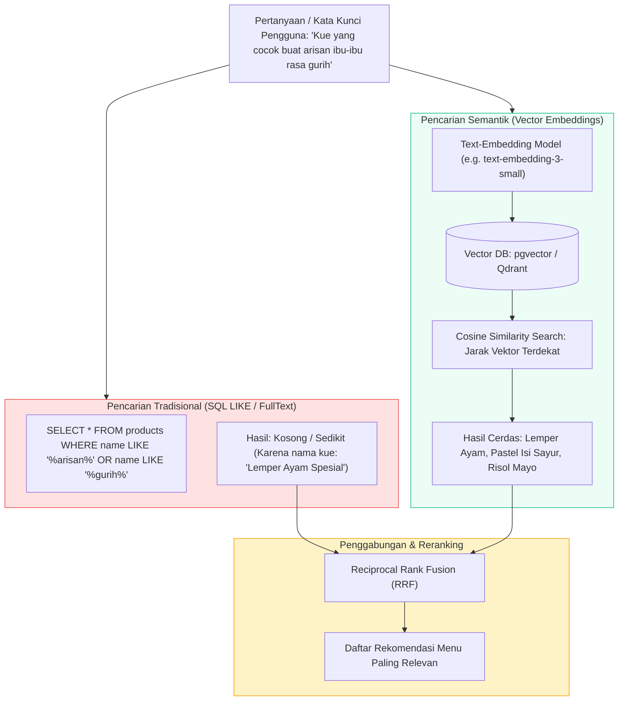

# 🧠 Migrasi ke Semantic Vector Database - Roadmap & Arsitektur

Dokumen ini menguraikan peta jalan transisi dari pencarian kata kunci berbasis SQL `LIKE %keyword%` menuju pencarian semantik vektor (*Vector Semantic Search*) menggunakan pgvector, Qdrant, atau ChromaDB untuk katalog jajanan dan Human Agent Bu Inem.

---

## 1. Arsitektur Hybrid: SQL Keyword + Vector Search



---

## 2. Struktur Data Embedding Produk

```json
{
  "product_id": 1,
  "name": "Lemper Ayam Spesial",
  "category": "Snack Tradisional",
  "flavor_profile": ["gurih", "asin", "santan gurih", "aroma daun pisang"],
  "event_suitability": ["arisan", "hajatan", "rapat kantor", "snack box"],
  "price": 3500,
  "vector_embedding": [0.0124, -0.0452, 0.0891, "...(1536 dimensi)..."]
}
```

---

## 3. Tahapan Implementasi Migrasi Vektor

1. **Fase 1 (Current)**: Pencarian frontend memfilter data produk lokal di sisi klien dengan pagination cepat dan search keyword.
2. **Fase 2 (Hybrid Sync)**: Saat produk ditambahkan atau diubah di backend, event listener mengirim ringkasan teks produk ke model embedding dan menyimpan vektor ke koleksi vector database.
3. **Fase 3 (Agent Grounding)**: Human Agent Bu Inem menanyakan vector database untuk rekomendasi menu berdasarkan konteks emosional dan anggaran pelanggan.
