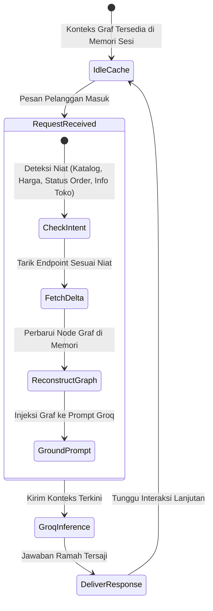
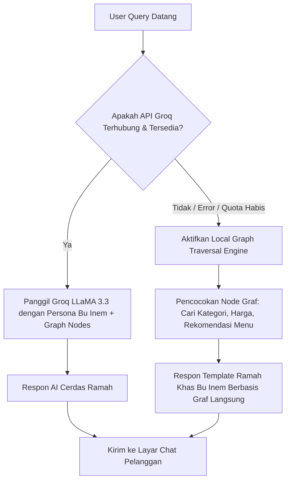

# 🔄 Agent Learning Pipeline - Pembelajaran Mandiri dari API Endpoint

Dokumen ini mendokumentasikan pipeline pembelajaran adaptif (*adaptive learning & synchronization*) Human Agent Bu Inem yang secara dinamis menyegarkan konteks pengetahuannya setiap kali ada pembaruan produk, perubahan harga, atau pergantian status pesanan.

---

## 1. Siklus Pembelajaran & Refresh Pengetahuan

---

## 2. Pola Penanganan Kegagalan (Graceful Degradation)

---

## 3. Batasan Keamanan Peran Pelanggan (Customer Role Guardrails)

- **Strict Customer Role Scope**: Agen HANYA menarik data dari endpoint yang diizinkan untuk peran publik/pelanggan (`business-settings`, `services`, `products`, `orders/{num}/status`).
- **No Internal Leaks**: Agen secara ketat dilarang meminta atau memaparkan informasi sensitif internal seperti `users`, password hash, laporan laba rugi admin, atau data kredensial pembayaran.
