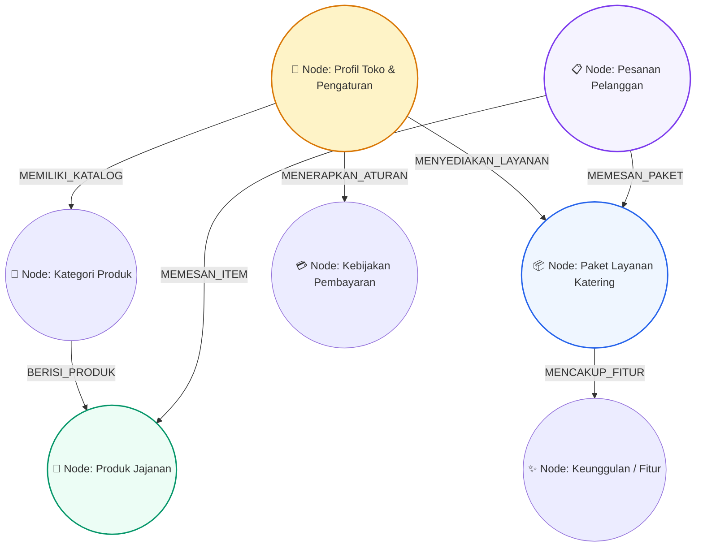

# 🕸️ Graph RAG Methodology - Ekstraksi Pengetahuan Berbasis Graf

Dokumen ini mendokumentasikan metodologi **Graph-based Learning & Retrieval** di mana agen AI tidak sekadar membaca teks datar, melainkan memetakan simpul (*nodes*) dan relasi (*edges*) entitas bisnis dari endpoint berwewenang peran pelanggan (*customer role access*).

---

## 1. Topologi Knowledge Graph Entitas Bisnis



---

## 2. Pemetaan Endpoint Customer ke Node Graf

```mermaid
flowchart LR
    subgraph CustomerEndpoints["Endpoint Akses Pelanggan (Public / Customer Role)"]
        EP_Settings["GET /api/v1/business-settings"]
        EP_Services["GET /api/v1/services"]
        EP_Products["GET /api/v1/products"]
        EP_OrderStatus["GET /api/v1/orders/{orderNumber}/status"]
    end

    subgraph GraphConstructor["Graph Builder Engine (Client / Server)"]
        Extractor["Parser & Entity Linker"]
        Linker["Hubungkan Edges Relasional"]
    end

    subgraph GraphRepresentation["Struktur Graf Terstruktur"]
        G_Store["Nodes: Store Info, Phone, Address"]
        G_Services["Nodes: Packages, Prices, Durations"]
        G_Items["Nodes: Snack Items, Stock, Prices"]
        G_Order["Nodes: Live Order Status, Totals"]
    end

    CustomerEndpoints --> Extractor
    Extractor --> Linker
    Linker --> GraphRepresentation
```



---

## 3. Skema Representasi Node & Edge JSON

```json
{
  "graph": {
    "nodes": [
      { "id": "store_1", "type": "STORE", "label": "UMKM Jajanan Bu Inem", "hours": "07:00 - 21:00 WIB", "phone": "0812-3456-7890" },
      { "id": "srv_1", "type": "SERVICE", "name": "Paket Snack Box Rapat", "price": 15000, "duration": "H-1 Hari" },
      { "id": "prod_1", "type": "PRODUCT", "name": "Lemper Ayam Spesial", "price": 3500, "stock": 50 }
    ],
    "edges": [
      { "source": "store_1", "target": "srv_1", "relation": "OFFERS_SERVICE" },
      { "source": "srv_1", "target": "prod_1", "relation": "INCLUDES_ITEM" }
    ]
  }
}
```
