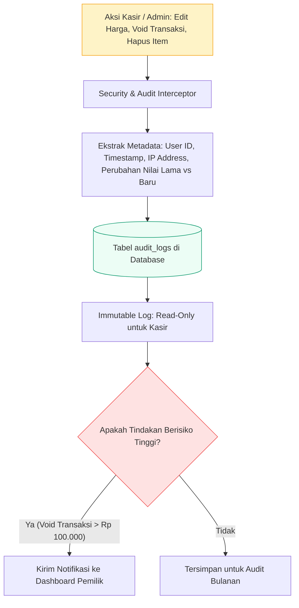

# 🛡️ Audit Logging & Internal Data Security

Dokumen ini mendokumentasikan sistem pencatatan audit (*audit logging*) internal dan kontrol keamanan data sensitif untuk melindungi UMKM dari manipulasi kas dan kebocoran data.

---

## 1. Arsitektur Audit Trail Finansial



---

## 2. Struktur Tabel `audit_logs`

```sql
CREATE TABLE IF NOT EXISTS audit_logs (
    id BIGINT AUTO_INCREMENT PRIMARY KEY,
    user_id INT NULL,
    action VARCHAR(50) NOT NULL,
    entity_name VARCHAR(50) NOT NULL,
    entity_id VARCHAR(50) NULL,
    old_value JSON NULL,
    new_value JSON NULL,
    ip_address VARCHAR(45) NULL,
    created_at TIMESTAMP DEFAULT CURRENT_TIMESTAMP,
    INDEX idx_audit_user (user_id),
    INDEX idx_audit_created (created_at)
) ENGINE=InnoDB DEFAULT CHARSET=utf8mb4;
```

---

## 3. Kebijakan Privasi Data Pelanggan

- Data nomor telepon pelanggan disamarkan (*masked*, misal: `0812****7890`) pada tampilan publik.
- Kata sandi pengguna sistem di-hash dengan standar industri **BCrypt** dengan cost factor 10.
- Token otorisasi tidak pernah disimpan dalam cookie terbuka tanpa atribut `HttpOnly` dan `SameSite`.
