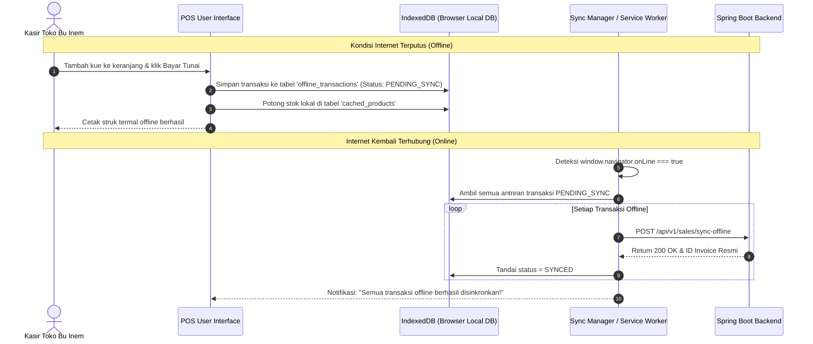

# 🗃️ IndexedDB & PWA Offline Persistence

Dokumen ini mendokumentasikan implementasi IndexedDB di browser kasir untuk mendukung operasional POS tanpa koneksi internet (*offline-first capability*) saat jaringan internet toko terputus.

---

## 1. Alur Sinkronisasi Offline-to-Online Kasir

---

## 2. Struktur Object Store IndexedDB

- **`products`**: Menyimpan seluruh katalog kue dengan indeks `id`, `code`, dan `category_id`.
- **`offline_sales`**: Menyimpan data transaksi kasir yang dibuat dalam keadaan offline.
- **`offline_sale_items`**: Menyimpan rincian item, kuantitas, dan harga transaksi offline.
