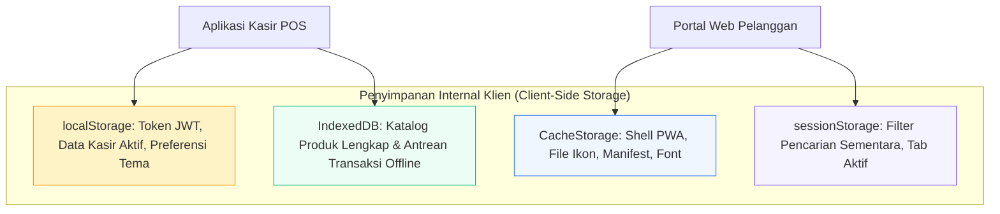

# 📦 Local Storage & Offline Cache Architecture

Dokumen ini mendokumentasikan pemanfaatan penyimpanan internal peramban (*browser local storage & session storage*) untuk menyimpan preferensi kasir, token JWT terenkripsi, serta keranjang belanja sementara.

---

## 1. Pembagian Ruang Simpan Browser (Browser Storage Allocation)

---

## 2. Struktur Kunci LocalStorage

| Key | Tipe Data | Deskripsi | Masa Berlaku |
| :--- | :--- | :--- | :--- |
| `auth_token` | String (JWT) | Token otorisasi kasir/admin | 24 Jam (Expires di server) |
| `pos_cart_state` | JSON Object | Item dalam keranjang kasir POS saat ini | Tetap tersimpan hingga checkout |
| `last_sync_timestamp`| Integer (Epoch) | Waktu terakhir katalog di-refresh dari server | Diperbarui per fetch |
| `human_agent_history`| JSON Array | Riwayat percakapan dengan Bu Inem di browser | Sesi pengguna |
