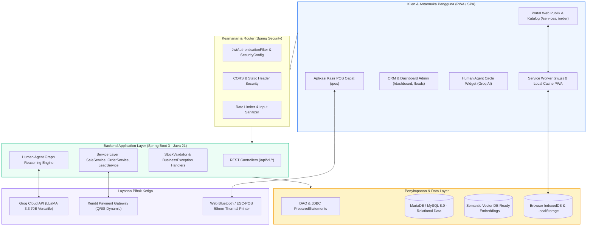
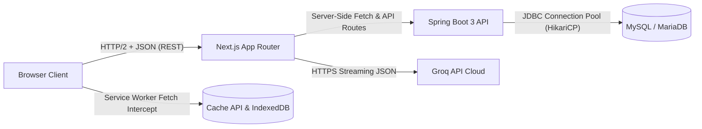

# 🏗️ Architecture Overview - Tech Stack Ekosistem UMKM Bu Inem

Dokumen ini memetakan arsitektur teknologi berlapis (*layered enterprise architecture*) dari UMKM Bu Inem yang menghubungkan Frontend Next.js 16, Backend Spring Boot 3 Java 21, Database MariaDB/MySQL, serta Human Agent berbasis Groq LLaMA 3.3.

---

## 1. Arsitektur Berlapis (Tiered Architecture)

---

## 2. Pola Komunikasi & Protokol

---

## 3. Matriks Spesifikasi Teknis

| Komponen | Teknologi | Versi | Alasan Pemilihan |
| :--- | :--- | :--- | :--- |
| **Backend Core** | Spring Boot / Java | 3.3.4 / Java 21 LTS | Performa tinggi, eksekusi bare-metal efisien, ekosistem keamanan matang |
| **Frontend Core** | Next.js / React | 16.1.6 / React 19 | SSR/SSG untuk SEO publik, PWA capabilities, App Router cepat |
| **Styling** | Tailwind CSS | 4.x / Modern CSS | Utilitas responsif cepat, ukuran bundle minimal, desain konsisten |
| **Database** | MariaDB / MySQL | 10.11+ / 8.0+ | Integritas transaksi ACID, indexing B-Tree cepat, hemat memori UMKM |
| **LLM Inference** | Groq Cloud API | LLaMA 3.3 70B | Kecepatan respons ultra-rendah (<1.5 detik), biaya hemat, inferensi cerdas |
| **Printer POS** | ESC/POS ESC | 58mm Thermal | Standar nota struk kasir ritel murah, tahan lama tanpa tinta |
