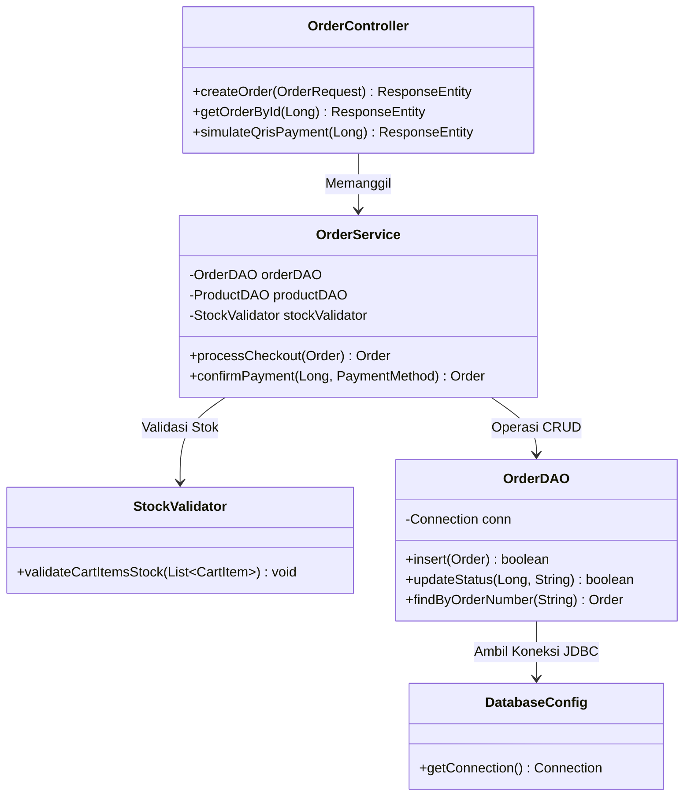

# ☕ Backend Tech Stack - Spring Boot 3 & Java 21

Dokumen ini menguraikan arsitektur backend Spring Boot 3, desain DAO murni tanpa ORM berat, konfigurasi keamanan stateless JWT, dan penanganan transaksi ACID.

---

## 1. Diagram Kelas & Alur Lapisan Backend

---

## 2. Fitur Kunci Backend

1. **Native JDBC DAO Tanpa ORM Berat**:
   - Menghindari overhead memori Hibernate/JPA di server UMKM yang hemat resource (VPS 1-2 GB RAM).
   - Query SQL eksplisit terlindung dari *N+1 query problem*.
   - Kecepatan respons kueri mikrodetik dengan `PreparedStatement`.

2. **Spring Security 6 Stateless JWT**:
   - Token bearer di header `Authorization: Bearer <token>`.
   - Tanpa session di sisi server, memungkinkan *horizontal scalability*.
   - Role-based authorization: `SUPER_ADMIN`, `ADMIN`, `CASHIER`, serta akses publik untuk endpoint katalog dan order.

3. **Integritas Transaksi ACID**:
   - `conn.setAutoCommit(false)` dengan `conn.commit()` dan `conn.rollback()` dalam blok `try-catch-finally` untuk menjamin pemotongan stok dan pembuatan invoice terjadi secara atomik.
