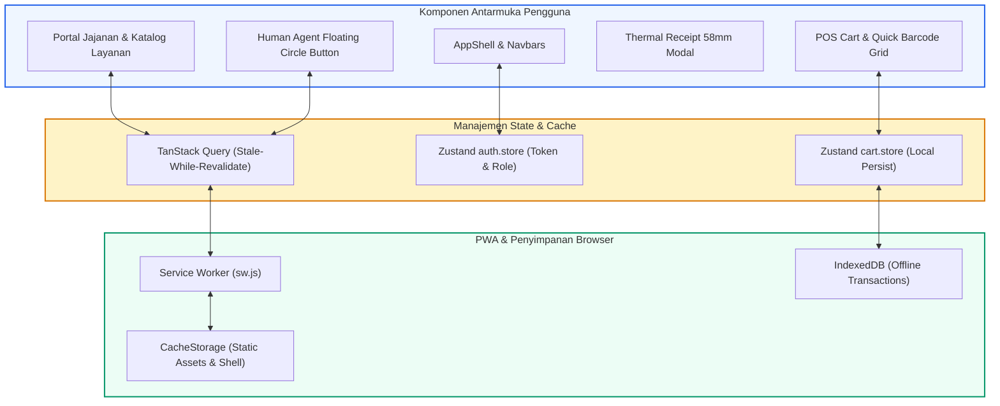

# ⚡ Frontend Tech Stack - Next.js 16 & Progressive Web App (PWA)

Dokumen ini mendokumentasikan arsitektur frontend modern menggunakan Next.js 16 (App Router), Zustand untuk manajemen state kasir, TanStack Query untuk caching data server, serta Service Worker untuk kemampuan PWA offline-first.

---

## 1. Arsitektur State & Alur Rendering Frontend

---

## 2. Fitur Unggulan Frontend

1. **Next.js 16 App Router & Server Components**:
   - SEO-friendly untuk halaman publik (`/`, `/services`, `/about`, `/faq`, `/pricing`).
   - Client Component interaktif untuk kasir cepat (`/pos`) dan formulir checkout order (`/order`).

2. **Progressive Web App (PWA) Siap Pasang**:
   - Disertai file `manifest.ts` dan service worker `sw.js`.
   - Dapat di-install di smartphone kasir Android/iOS dan tablet POS tanpa melalui Play Store (*standalone app*).

3. **Cetak Struk Termal 58mm Ramah Kertas**:
   - Mendukung format lebar 58mm standar kasir UMKM.
   - Pratinjau langsung, dialog print browser dengan CSS `@media print` tanpa header/footer browser.
