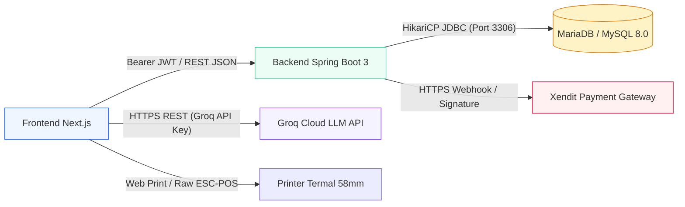

# 🔌 Integration Matrix - Matriks Antarmuka & Layanan

Dokumen ini memetakan seluruh titik integrasi sistem internal dan eksternal UMKM Bu Inem beserta protokol, autentikasi, dan strategi mitigasi kegagalannya.

---

## 1. Peta Topologi Integrasi

---

## 2. Tabel Spesifikasi Integrasi

| Titik Integrasi | Arah & Protokol | Format Payload | Autentikasi | Fallback Saat Offline/Error |
| :--- | :--- | :--- | :--- | :--- |
| **Frontend <-> Backend** | Bipasal / HTTP REST | JSON (`ApiResponse<T>`) | Bearer JWT Header | Cache lokal PWA & queue transaksi offline |
| **Backend <-> Database** | Sinkron / TCP JDBC | SQL PreparedStatements | Database Username & Password | Retry koneksi HikariCP + pool reconnection |
| **Agent <-> Groq API** | Bipasal / HTTPS REST | OpenAI Chat Completion format | `Authorization: Bearer gsk_...` | Local Graph Traversal Engine (tanpa LLM) |
| **Backend <-> Payment Gateway** | Asinkron Webhook | JSON (Xendit Signature) | HMAC Webhook Token | Polling manual status QRIS di dashboard |
| **Frontend <-> Kasir Printer** | Lokal / USB & Bluetooth | Plain text monospaced / ESC-POS | Driver Sistem Operasi | Cetak PDF / simpan tangkapan layar receipt |
