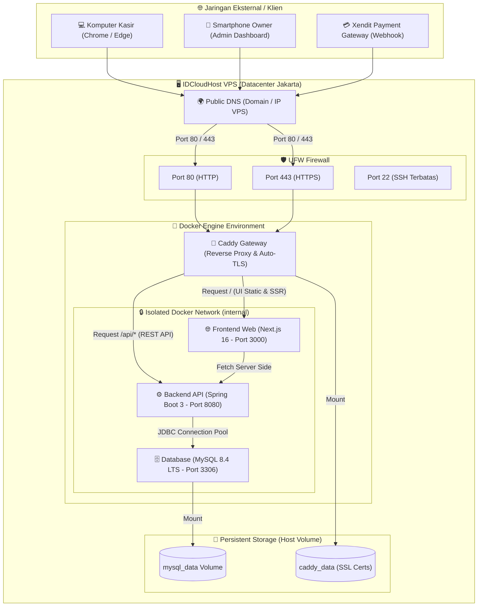
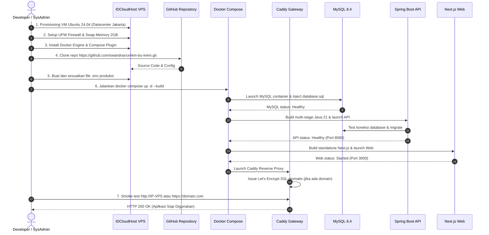

# 🚀 Panduan Deployment VPS (IDCloudHost / Ubuntu)

Panduan komprehensif deployment produksi untuk **Jajanan Ibu Inem POS** menggunakan **Virtual Private Server (VPS) IDCloudHost** berbasis **Ubuntu 24.04 / 22.04 LTS** dan **Docker Compose**.

---

## 📊 Visualisasi Arsitektur & Alur Deployment

### 1. Diagram Arsitektur Deployment VPS (Network & Container Topology)



---

### 2. Diagram Alur Proses Deployment (Deployment Lifecycle)



---

## 💻 Rekomendasi Spesifikasi IDCloudHost

Saat membuat instance Cloud VPS di console [IDCloudHost](https://console.idcloudhost.com/):

| Komponen | Spesifikasi Minimum | Rekomendasi Ideal (Produksi) |
|---|---|---|
| **OS** | Ubuntu 22.04 LTS | Ubuntu 24.04 LTS (64-bit) |
| **vCPU** | 1 Core | **2 vCPU** |
| **RAM** | 2 GB (+ 2GB Swap) | **4 GB** |
| **Storage** | 30 GB SSD | **40 – 50 GB NVMe** |
| **Datacenter** | Jakarta / Indonesia | Jakarta / Indonesia (< 10ms latensi) |
| **Estimasi Biaya** | ± Rp 70.000 / bulan | ± Rp 100.000 – Rp 140.000 / bulan |

---

## 🛠️ Langkah-Langkah Deployment Lengkap

### Langkah 1: Akses Server via SSH

Buka terminal di komputer Anda (PowerShell / Command Prompt / Terminal macOS/Linux):
```bash
ssh root@<IP_VPS_ANDA>
```

---

### Langkah 2: Update Sistem & Konfigurasi Swap Memory (Wajib)

Swap memory sangat krusial untuk mencegah server kehabisan RAM (*Out of Memory / OOM*) saat proses kompilasi Java atau Next.js:

```bash
# 1. Update paket sistem
apt update && apt upgrade -y

# 2. Buat Swap file 2GB
fallocate -l 2G /swapfile
chmod 600 /swapfile
mkswap /swapfile
swapon /swapfile

# 3. Jadikan permanen saat reboot
echo '/swapfile none swap sw 0 0' >> /etc/fstab

# 4. Verifikasi swap aktif
free -h
```

---

### Langkah 3: Install Docker Engine & Docker Compose

Jalankan perintah resmi dari Docker untuk instalasi versi terbaru:

```bash
# Install tool pembantu
apt install -y curl git ufw

# Install Docker Engine
curl -fsSL https://get.docker.com -o get-docker.sh
sh get-docker.sh

# Install Docker Compose Plugin
apt install -y docker-compose-plugin

# Verifikasi instalasi
docker --version
docker compose version
```

---

### Langkah 4: Konfigurasi Firewall Keamanan (UFW)

Lindungi server agar port database (3306) dan internal tidak dapat diakses langsung dari internet:

```bash
# Buka port SSH, HTTP, dan HTTPS
ufw allow 22/tcp
ufw allow 80/tcp
ufw allow 443/tcp

# Aktifkan firewall
ufw --force enable

# Cek status
ufw status
```

---

### Langkah 5: Clone Repository

```bash
cd /opt
git clone https://github.com/swandrax/umkm-bu-inem.git
cd umkm-bu-inem
```

---

### Langkah 6: Konfigurasi Environment Variables (`.env`)

Salin template `.env.example` ke `.env`:
```bash
cp .env.example .env
nano .env
```

Sesuaikan nilai-nilai produksi berikut:
```env
# ===================================================================
# KONFIGURASI DATABASE PRODUKSI
# ===================================================================
DB_NAME=jajanan_ibu_inem
DB_USERNAME=app_user
DB_PASSWORD=GantiDenganPasswordDBYangSangatKuat123!
MYSQL_ROOT_PASSWORD=GantiDenganPasswordRootYangSangatKuat123!

# ===================================================================
# KEAMANAN JWT (Wajib minimal 32 karakter acak!)
# ===================================================================
JWT_SECRET=f4a7c8e9d0b1a2f3c4e5d6a7b8c9e0f1a2b3c4d5e6f7a8b9c0d1e2f3a4b5c6d7
JWT_EXPIRATION=900000

# ===================================================================
# PORT GATEWAY & CORS
# ===================================================================
WEB_PORT=80
CORS_ALLOWED_ORIGINS=http://localhost:3000,http://<IP_VPS_ANDA>

# ===================================================================
# XENDIT PAYMENT GATEWAY (Opsional - Diisi jika menggunakan QRIS)
# ===================================================================
XENDIT_ENABLED=false
XENDIT_SECRET_KEY=
XENDIT_WEBHOOK_TOKEN=
```
> **Tips Simpan**: Tekan `Ctrl + O`, lalu `Enter`, kemudian `Ctrl + X` untuk keluar dari nano.

---

### Langkah 7: Konfigurasi Domain & HTTPS / SSL Otomatis (Opsional)

Jika Anda sudah memiliki nama domain (contoh: `pos.tokobuinem.com`):
1. Masuk ke panel domain Anda (Cloudflare / Niagahoster / IDwebhost / dll.).
2. Buat **DNS A Record**:
   - Host: `pos` (atau `@`)
   - Points to: `<IP_VPS_ANDA>`
3. Buka file konfigurasi Caddy di VPS:
   ```bash
   nano ops/caddy/Caddyfile
   ```
4. Ganti baris `:80` dengan nama domain Anda:
   ```caddy
   pos.tokobuinem.com {
       encode zstd gzip
       header {
           X-Content-Type-Options nosniff
           X-Frame-Options DENY
           Referrer-Policy no-referrer
           Permissions-Policy "camera=(), microphone=(), geolocation=()"
       }
       handle /api/* {
           reverse_proxy api:8080
       }
       handle {
           reverse_proxy web:3000
       }
   }
   ```
5. Simpan file (`Ctrl + O`, `Enter`, `Ctrl + X`).

> [!NOTE]
> Caddy secara otomatis akan merequest dan memperbarui sertifikat SSL Let's Encrypt (HTTPS) tanpa perlu setting Certbot manual! Jika belum punya domain, biarkan tetap `:80`.

---

### Langkah 8: Build dan Jalankan Aplikasi

Jalankan seluruh service aplikasi:
```bash
docker compose up -d --build
```

Proses ini akan:
1. Men-download image MySQL 8.4 dan Caddy.
2. Meng-compile backend Spring Boot (Java 21) menjadi `.jar`.
3. Meng-compile frontend Next.js 16 menjadi `standalone production build`.
4. Menginjeksi struktur database dan seed awal dari `database.sql`.
5. Mengaktifkan gateway proxy di port 80/443.

---

### Langkah 9: Verifikasi Status & Akses Aplikasi

1. **Periksa status container**:
   ```bash
   docker compose ps
   ```
   Pastikan keempat container (`mysql`, `api`, `web`, `gateway`) berstatus `Up` / `healthy`.

2. **Periksa log aplikasi (jika ingin melihat alur start)**:
   ```bash
   # Log API Backend
   docker compose logs -f api

   # Log Frontend Next.js
   docker compose logs -f web
   ```

3. **Akses Aplikasi melalui Browser**:
   - Jika tanpa domain: `http://<IP_VPS_ANDA>`
   - Jika dengan domain: `https://pos.tokobuinem.com`

4. **Kredensial Default Login**:
   - **Admin**: Username: `admin` | Password: `admin123`
   - **Kasir**: Username: `kasir` | Password: `kasir123`
   *(Segera ubah password setelah login pertama kali di menu Pengaturan Pengguna).*

---

## 🔄 Prosedur Update Aplikasi (CI/CD Deployment Routine)

Jika di kemudian hari ada pembaruan kode di GitHub:

```bash
cd /opt/umkm-bu-inem

# 1. Tarik pembaruan kode terbaru
git pull origin main

# 2. Rebuild container yang mengalami perubahan
docker compose up -d --build

# 3. Hapus cache image lama agar disk tidak penuh
docker image prune -f
```

---

## 💾 SOP Backup Database Rutin

Untuk mencegah kehilangan data transaksi, buat script auto-backup harian:

```bash
# 1. Buat folder backup
mkdir -p /root/backups

# 2. Test dump database manual
docker compose exec mysql mysqldump -u app_user -pGantiDenganPasswordDBYangSangatKuat123! jajanan_ibu_inem > /root/backups/backup_$(date +%F).sql

# 3. Tambahkan ke cron job harian (otomatis jam 02:00 pagi)
crontab -e
```
Tambahkan baris berikut di paling bawah:
```cron
0 2 * * * cd /opt/umkm-bu-inem && docker compose exec -T mysql mysqldump -u app_user -pGantiDenganPasswordDBYangSangatKuat123! jajanan_ibu_inem | gzip > /root/backups/backup_$(date +\%F).sql.gz
```

---

## ❓ Troubleshooting Masalah Umum

| Gejala | Penyebab Umum | Solusi |
|---|---|---|
| Container API berulang kali restart | Database MySQL belum siap atau password di `.env` salah | Jalankan `docker compose logs api` untuk melihat stack trace. Pastikan `DB_PASSWORD` sama dengan password MySQL. |
| Build frontend gagal karena OOM | RAM server tidak cukup saat kompilasi Next.js | Pastikan Swap Memory 2GB sudah aktif (`free -h`). |
| Website tidak bisa dibuka di browser | Port 80/443 terblokir Firewall | Cek `ufw status`. Pastikan `ufw allow 80/tcp` dan `ufw allow 443/tcp` sudah dijalankan. |
| Domain belum bisa diakses HTTPS | DNS A Record belum terpropagasi atau port 80/443 terblokir | Pastikan A Record mengarah ke IP VPS Anda, lalu cek log Caddy: `docker compose logs gateway`. |
