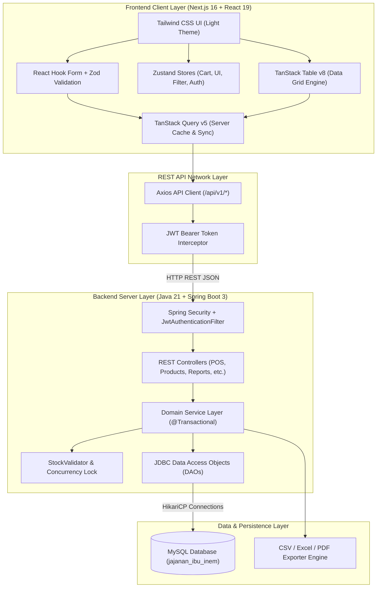
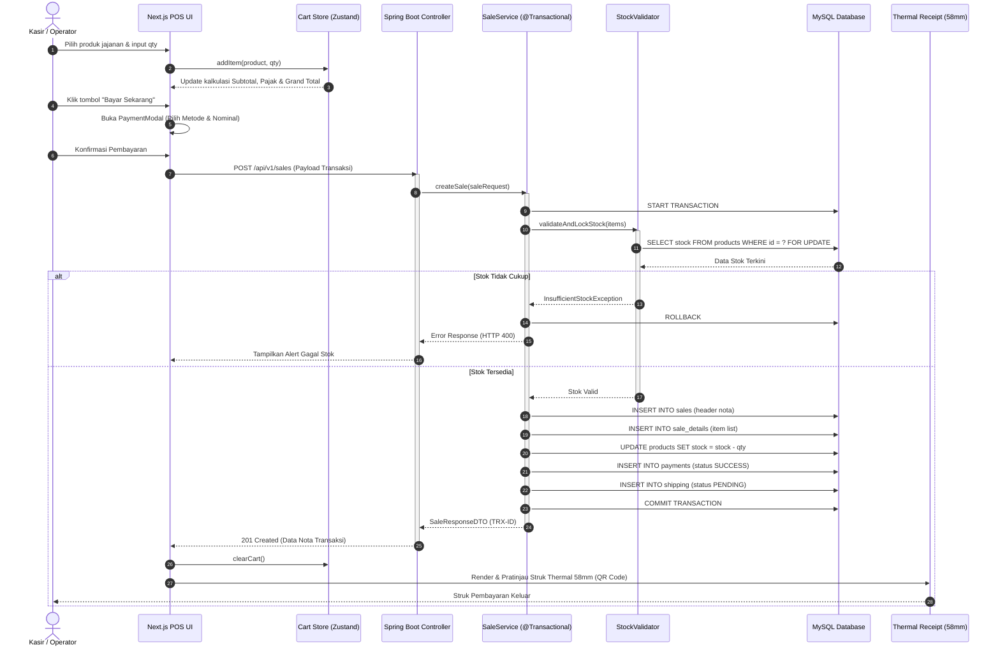
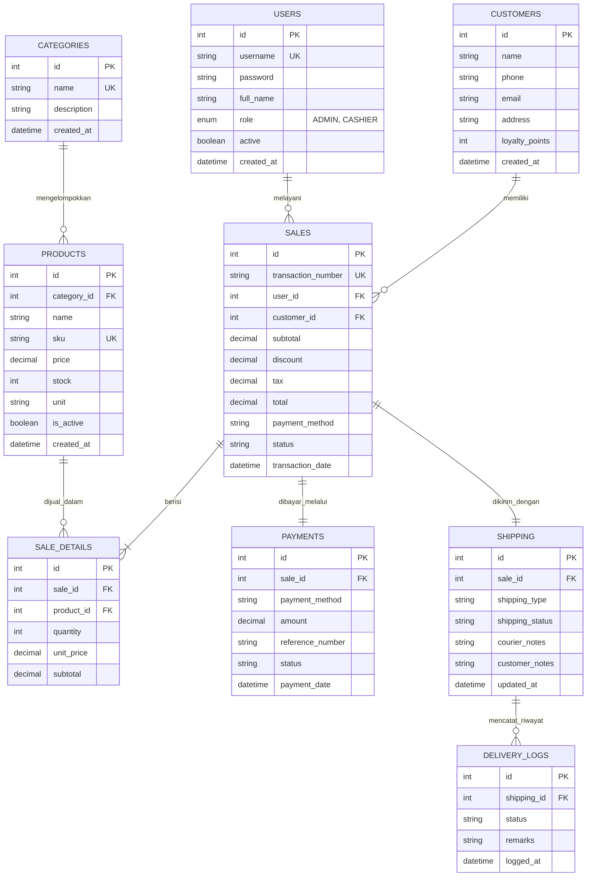
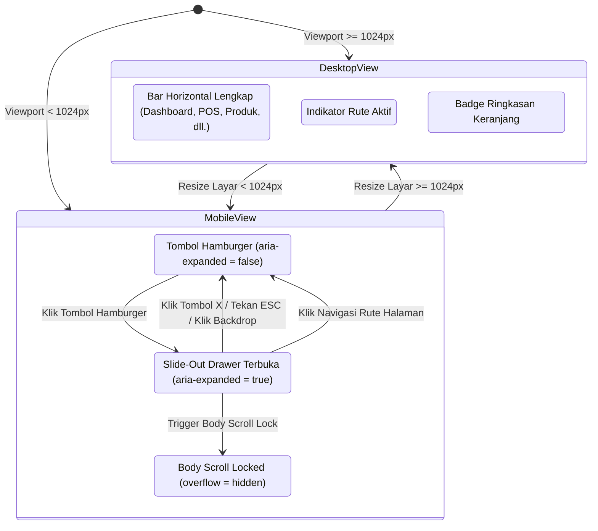

# Jajanan Ibu Inem - Modern Full-Stack POS Architecture

Sistem Point of Sales (POS) & Manajemen Toko UMKM modern untuk **Jajanan Ibu Inem**. Dibangun dengan arsitektur full-stack modern menggunakan **Java 21 + Spring Boot 3** sebagai satu-satunya backend utama, **Next.js 16 (App Router) + TypeScript** sebagai frontend web modern, dan **tanpa legacy PHP**.

---

## 📑 Daftar Isi
1. [Tech Stack & Arsitektur Utama](#-tech-stack--arsitektur-utama)
2. [Metodologi Desain & Pengembangan](#-metodologi-desain--pengembangan)
3. [Algoritma Utama Sistem](#-algoritma-utama-sistem)
4. [Visualisasi Diagram Arsitektur & Alur Sistem](#-visualisasi-diagram-arsitektur--alur-sistem)
   - [Diagram Arsitektur Sistem (High-Level Architecture)](#1-diagram-arsitektur-sistem-high-level-architecture)
   - [Diagram Alur Transaksi POS (Sequence Diagram)](#2-diagram-alur-transaksi-pos-sequence-diagram)
   - [Diagram Relasi Entitas Database (Entity Relationship Diagram / ERD)](#3-diagram-relasi-entitas-database-erd)
   - [Diagram State Navigasi Responsif & Mobile Drawer](#4-diagram-state-navigasi-responsif--mobile-drawer)
5. [Fitur Utama Aplikasi](#-fitur-utama-aplikasi)
6. [Struktur Direktori Repository](#-struktur-direktori-repository)
7. [Panduan Menjalankan Aplikasi](#-panduan-menjalankan-aplikasi)

---

## 🏗️ Tech Stack & Arsitektur Utama

### Backend (Java 21 + Spring Boot 3)
- **Runtime**: Java 21 (LTS) OpenJDK
- **Framework**: Spring Boot 3.4.x
- **Architecture**: Clean Layered Architecture (`controller` ➔ `service` ➔ `repository` / `dao` ➔ `MySQL`)
- **API Standard**: RESTful API `/api/v1/*` dengan pembungkus payload seragam `ApiResponse<T>`
- **Security & Auth**: Spring Security + Stateless JWT (JSON Web Token) + BCrypt Password Hashing
- **Data Persistence**: MySQL JDBC & HikariCP High-Performance Connection Pool
- **Integrity**: Transactional ACID Boundaries (`@Transactional`) & Concurrency Stock Validator

### Frontend (Next.js 16 + React 19 + TypeScript)
- **Framework**: Next.js 16 (App Router, Turbopack, Standalone Static/Dynamic Compilation)
- **UI Library**: React 19 + TypeScript 5
- **Server State Management**: **TanStack Query (React Query v5)** (caching, query invalidation, refetching, mutations)
- **Data Table Engine**: **TanStack Table (v8)** (sorting, filtering, fluid pagination, horizontal auto-scroll)
- **Client & UI State**: **Zustand** (`cart.store.ts`, `ui.store.ts`, `filter.store.ts`, `auth.store.ts`)
- **Form Handling & Validation**: **React Hook Form** + **Zod Schema Resolver**
- **Styling**: **Tailwind CSS v4** dengan filosofi **LIGHT THEME ONLY** (palet hangat UMKM: `#faf9f5` soft warm white, amber-500, orange-600, stone-900)
- **Icons**: Lucide React
- **Output Cetak**: 58mm Thermal Receipt CSS Media Query & QR Code Verification

---

## 🔬 Metodologi Desain & Pengembangan

Sistem ini dirancang menggunakan 3 pilar metodologi rekayasa perangkat lunak:

1. **Clean Layered Domain-Driven Methodology**:
   - **Separation of Concerns (SoC)**: Logika bisnis kasir, kalkulasi pajak/diskon, dan mutasi stok diisolasi di layer `service`, terpisah dari layer HTTP `controller` dan query database `dao`.
   - **Stateless Authentication**: Token JWT dikirim melalui header `Authorization: Bearer <token>`, memungkinkan backend bersifat stateless dan mudah di-scale.

2. **Mobile-First Responsive Design Methodology (DevTools Compliant)**:
   - Layout tidak sekadar diperkecil (*scaled down*), melainkan beradaptasi secara dinamis (*fluid layout*) pada 6 target viewport DevTools:
     - Desktop: `1440 × 900`
     - Laptop: `1280 × 800`
     - Tablet Landscape: `1024 × 768`
     - Tablet Portrait: `768 × 1024`
     - Mobile Modern: `390 × 844`
     - Small Mobile: `375 × 667`
   - Menggunakan CSS Grid `repeat(auto-fill, minmax(...))`, Flexbox wrap, serta peniadaan overflow horizontal (`overflow-x: hidden` dan `max-width: 100vw`).

3. **Business Model Canvas (BMC) Analytics Methodology**:
   - Modul pelaporan mingguan mengadopsi struktur Business Model Canvas:
     - **Revenue Streams**: Agregasi omset penjualan per kanal pembayaran (Tunai, QRIS, Transfer, Dompet Digital).
     - **Key Activities & Resources**: Monitoring pergerakan stok jajanan pasar dan produk terlaris (*Top Selling*).
     - **Customer Relationships**: Pelacakan loyalitas pelanggan dan riwayat pesanan.
     - **Exporting Engine**: Ekspor CSV otomatis dengan parameter rentang tanggal bergulir 7 hari untuk analisis data lanjutan di spreadsheet atau tools visualisasi data (Tableau, PowerBI).

---

## 🧠 Algoritma Utama Sistem

### 1. Algoritma Transaksi Atomik & Penguncian Stok Konkuren (Anti-Overselling)
Untuk mencegah *race condition* saat beberapa kasir menjual produk yang sama secara bersamaan:

```text
Input: saleRequest (customerId, items[productId, quantity], paymentMethod, cashAmount)
Output: SaleResult (saleId, status, invoiceNumber)

1. START TRANSACTION (Isolation Level: READ_COMMITTED)
2. FOR EACH item IN saleRequest.items:
     a. Query Produk dengan kunci: SELECT id, stock, price, is_active FROM products WHERE id = ? FOR UPDATE
     b. IF NOT FOUND OR is_active == false THEN:
          ROLLBACK TRANSACTION
          THROW ProductNotFoundException
     c. IF item.quantity <= 0 THEN:
          ROLLBACK TRANSACTION
          THROW InvalidQuantityException
     d. IF item.quantity > product.stock THEN:
          ROLLBACK TRANSACTION
          THROW InsufficientStockException("Stok tidak mencukupi untuk: " + product.name)
3. Hitung Subtotal = SUM(item.quantity * product.price)
4. Hitung Nilai Pajak = Subtotal * TaxRate (misal: 11% atau 0%)
5. Hitung Grand Total = Subtotal - Discount + Nilai Pajak
6. IF paymentMethod == "CASH" AND cashAmount < Grand Total THEN:
     ROLLBACK TRANSACTION
     THROW InsufficientCashException("Uang tunai kurang")
7. Simpan header penjualan ke tabel `sales` -> Dapatkan `sale_id`
8. FOR EACH item IN saleRequest.items:
     a. Simpan detail item ke `sale_details`
     b. Kurangi stok: UPDATE products SET stock = stock - item.quantity WHERE id = item.productId
9. Simpan catatan pembayaran ke `payments`
10. Buat record awal pengiriman ke `shipping` (Status: PENDING)
11. COMMIT TRANSACTION
12. RETURN invoice DTO dengan nomor struk unik TRX-{TIMESTAMP}-{ID}
```

### 2. Algoritma Perhitungan Kembalian Uang Kasir (Greedy Cashier)
Menjamin verifikasi pembayaran tunai kasir POS:
$$\text{Kembalian} = \max(0, \text{Uang Diterima} - \text{Grand Total})$$
Jika $\text{Uang Diterima} < \text{Grand Total}$, antarmuka kasir menolak submit dan menampilkan alert nominal kekurangan pembayaran secara instan.

### 3. Algoritma Navigasi Responsif & Penguncian Scroll Mobile (Drawer State Machine)
Menangani interaksi menu hamburger secara accessible:
- Pada resolusi $\ge 1024\text{px}$: Tampilkan bar navigasi horizontal penuh.
- Pada resolusi $< 1024\text{px}$: Sembunyikan tautan desktop, aktifkan tombol hamburger.
- Saat hamburger diklik (`open = true`):
  1. Set atribut `aria-expanded="true"`.
  2. Aktifkan backdrop overlay dengan efek blur.
  3. Kunci scroll latar belakang: `document.body.style.overflow = "hidden"`.
- Saat rute dipilih / klik luar / tombol `Escape` ditekan (`open = false`):
  1. Set atribut `aria-expanded="false"`.
  2. Kembalikan scroll latar: `document.body.style.overflow = ""`.
  3. Transisi slide-out drawer ke sisi layar.

---

## 📊 Visualisasi Diagram Arsitektur & Alur Sistem

### 1. Diagram Arsitektur Sistem (High-Level Architecture)



---

### 2. Diagram Alur Transaksi POS (Sequence Diagram)



---

### 3. Diagram Relasi Entitas Database (ERD)



---

### 4. Diagram State Navigasi Responsif & Mobile Drawer



---

## 🚀 Fitur Utama Aplikasi

1. **Kasir POS Responsif (`/pos`)**:
   - Filter cepat kategori dan pencarian instan nama produk jajanan.
   - Keranjang POS dinamis dengan kalkulasi diskon, subtotal, pajak, dan kembalian.
   - **Floating Checkout Bar** di layar mobile untuk akses pembayaran satu sentuhan.
   - Pratinjau struk thermal 58mm dengan kode QR verifikasi invoice.

2. **Dashboard Metrik Bisnis Real-Time (`/dashboard`)**:
   - Menampilkan total omset harian, jumlah transaksi, item terjual, dan direktori pelanggan.
   - Peringatan stok menipis (*Low Stock Alert*) untuk memprioritaskan restock jajanan.
   - Grafik ranking produk terlaris (*Top Selling*) dan distribusi saluran pembayaran.

3. **Master Data Produk (`/products`)**:
   - Pengelolaan aneka kue basah, jajanan pasar, snack, dan minuman.
   - Validasi ketat menggunakan Zod & React Hook Form.
   - Tabel responsif berbasis TanStack Table dengan sorting dan pagination.

4. **Kategori Jajanan (`/categories`)**:
   - Pengelompokan jenis jajanan UMKM secara terstruktur.

5. **Direktori Pelanggan & Loyalitas (`/customers`)**:
   - Pencatatan nomor telepon/WhatsApp pelanggan dan akumulasi poin loyalitas.

6. **Riwayat Transaksi & Struk Kasir (`/transactions`)**:
   - Pencarian transaksi berdasarkan nomor nota atau rentang tanggal.
   - Fitur cetak ulang struk thermal kapan saja.

7. **Monitoring Pembayaran (`/payments`)**:
   - Pemantauan mutasi 8 saluran pembayaran: **CASH, QRIS, TRANSFER, DEBIT, GOPAY, OVO, DANA, SHOPEEPAY**.

8. **Manajemen Pengiriman & Kurir (`/shipping`)**:
   - Pelacakan status pengantaran jajanan (PENDING, PROCESSING, SHIPPED, DELIVERED, CANCELLED).
   - Penginputan nomor resi kurir dan catatan penerimaan pesanan.

9. **Laporan & Ekspor Data Analitik BMC (`/reports`)**:
   - Rekap harian, mingguan, dan bulanan.
   - **Ekspor CSV Khusus BMC Analitik Mingguan** untuk analisis Business Model Canvas.
   - Ekspor laporan spreadsheet Excel (`.xlsx`) dan format cetak PDF.

10. **Pengaturan Identitas Toko & POS (`/settings`)**:
    - Konfigurasi nama toko, nomor telepon WhatsApp, alamat usaha, dan footer struk.

11. **Manajemen Akun Pengguna (`/users`)**:
    - Pengelolaan hak akses Admin dan Kasir (Role-Based Access Control).

---

## 📁 Struktur Direktori Repository

```text
umkm-bu-inem/
├── .mvn/                          # Maven Wrapper files
├── .vscode/                       # Pengaturan VSCode & TypeScript SDK
├── frontend/                      # Aplikasi Frontend Next.js 16 (App Router)
│   ├── src/
│   │   ├── app/                   # Rute halaman Next.js (Dashboard, POS, Produk, dll.)
│   │   ├── components/            # Komponen UI, Layout (Navbar, AppShell), & POS
│   │   ├── hooks/                 # TanStack Query custom hooks
│   │   ├── lib/                   # REST API client & utilities
│   │   ├── schemas/               # Zod validation schemas
│   │   ├── stores/                # Zustand client state stores
│   │   └── types/                 # TypeScript interfaces
│   ├── package.json
│   └── tsconfig.json
│
├── src/main/java/com/ibuinem/pos/  # Backend Spring Boot 3
│   ├── config/                    # Security, CORS, dan WebConfig
│   ├── controller/                # REST API Controllers (/api/v1/*)
│   ├── dao/                       # MySQL JDBC Data Access
│   ├── dto/                       # Request & Response DTOs
│   ├── exception/                 # Global Exception Handler
│   ├── mapper/                    # Entity Mappers
│   ├── model/                     # Java Domain Models
│   ├── repository/                # Repository Interfaces
│   ├── security/                  # JWT Authentication Filters & Provider
│   ├── service/                   # Business Logic & @Transactional Services
│   ├── utils/                     # Exporter CSV, Excel, PDF
│   ├── validation/                # Concurrency & Stock Validators
│   └── PosApplication.java        # Spring Boot Entry Point
│
├── database.sql                   # Skema dan Seed Data MySQL
├── pom.xml                        # Maven Dependencies (Spring Boot 3, Java 21)
├── tsconfig.json                  # Root Monorepo TypeScript Configuration
├── .env.example                   # Contoh konfigurasi Environment Variables
└── README.md                      # Dokumentasi Utama Proyek
```

---

## ⚙️ Panduan Menjalankan Aplikasi

### 1. Prasyarat Sistem
- **Java 21 (JDK 21 LTS)**
- **Node.js (v20+ atau v18+)** dan **npm**
- **MySQL Database Server** (XAMPP, Laragon, Docker, atau MySQL Server standalone)

### 2. Setup Database MySQL
1. Pastikan service MySQL sudah berjalan.
2. Buat database dan import skema [database.sql](database.sql):
   ```bash
   mysql -u root -p < database.sql
   ```
   *(Atau buat database `jajanan_ibu_inem` lalu import file `database.sql` melalui phpMyAdmin / HeidiSQL).*

### 3. Menjalankan Backend Spring Boot
Dari root direktori project (`umkm-bu-inem-main`):
```powershell
# Windows
.\mvnw.cmd spring-boot:run

# Linux / macOS
./mvnw spring-boot:run
```
Backend akan aktif di: **`http://localhost:8080`**  
Base Endpoint REST API: **`http://localhost:8080/api/v1/*`**

### 4. Menjalankan Frontend Next.js
Buka terminal baru, masuk ke direktori `frontend`:
```powershell
cd frontend
npm install
npm run dev
```
Frontend akan aktif di: **`http://localhost:3000`**

### 5. Akun Login Default
| Role | Username | Password | Keterangan |
| :--- | :--- | :--- | :--- |
| **Admin** | `admin` | `admin123` | Akses penuh (Dashboard, Master, Laporan, Pengaturan, User) |
| **Kasir** | `kasir` | `kasir123` | Akses operasional kasir POS & riwayat transaksi |

> **Mode Cepat**: Pada halaman Login terdapat tombol **`⚡ Masuk Cepat Sebagai Kasir (Mode Dummy)`** untuk langsung masuk ke sistem POS tanpa mengetik manual.
