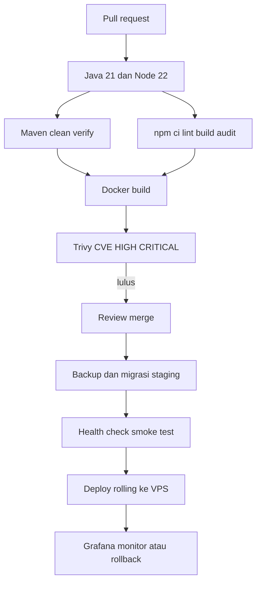
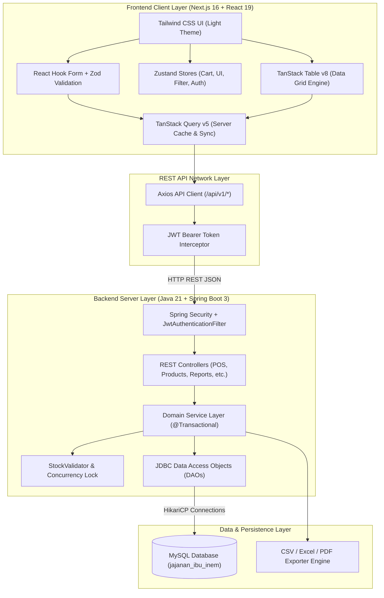
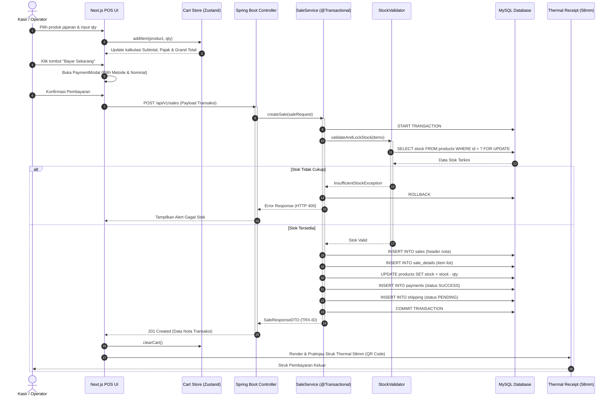
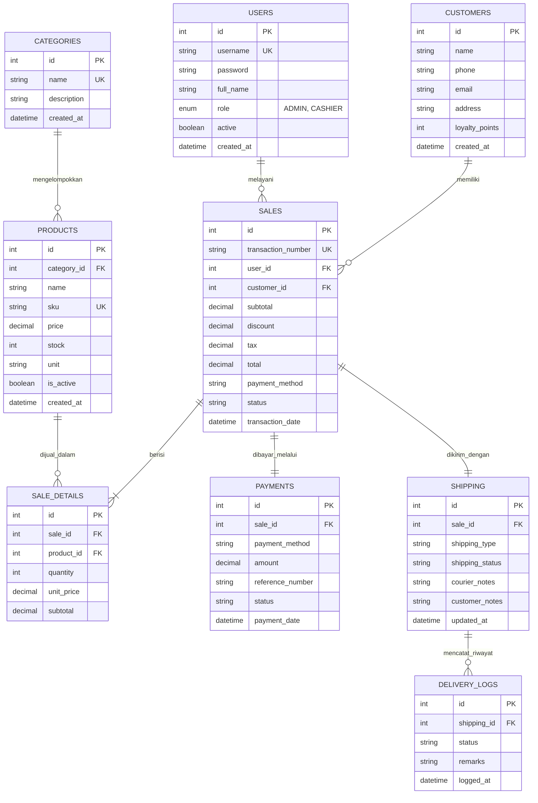
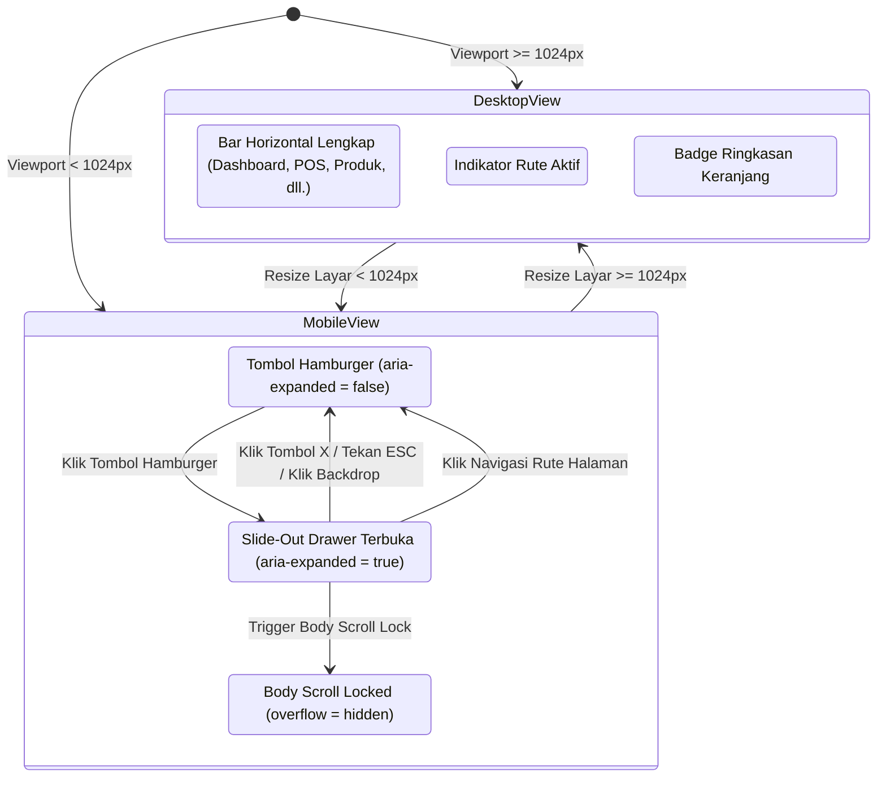

# UMKM Bu Inem - Digital Business, Marketing, CRM & Commerce Platform

Platform Terpadu **Digital Marketing, CRM, Manajemen Layanan, Pemesanan Online, Pembayaran Real-Time, dan Operasional UMKM** untuk **UMKM Bu Inem**. Berevolusi dari sistem kasir internal menjadi ekosistem digital lengkap berbasis **Java 21 + Spring Boot 3** (backend otoritatif) dan **Next.js 16 (App Router) + React 19 + TypeScript + Tailwind CSS v4** (frontend modern light-theme).

> 📊 **Laporan & Dokumentasi Arsitektur Terpadu**:
> - [Laporan Optimasi & Benchmark 67%+](docs/optimization-report.md)
> - [Baseline Pengukuran Awal](docs/optimization-baseline.md)
> - [Arsitektur CRM & Marketing](docs/crm-architecture.md)
> - [Alur Pemesanan & Pembayaran QRIS / Cash](docs/order-payment-flow.md)
> - [Kompatibilitas Sistem Kasir POS Legacy](docs/legacy-compatibility.md)
> - [Panduan Deployment VPS & Kontrol Privasi](docs/security-and-privacy.md)

## Operasional, CI/CD, dan Skalabilitas

> 📖 **Panduan Deployment VPS Lengkap**: Lihat [DEPLOYMENT.md](DEPLOYMENT.md) untuk panduan step-by-step setup VPS (IDCloudHost / Ubuntu), konfigurasi swap, firewall, domain, HTTPS otomatis, dan backup database.

Jalankan secara lokal/VPS dengan Docker:

1. Salin `.env.example` menjadi `.env`, isi secret unik; `JWT_SECRET` minimal 32 byte dan semua password wajib diganti.
2. Jalankan `docker compose up --build`; aplikasi tersedia pada `http://localhost`.
3. Tambahkan Grafana dan Prometheus dengan `docker compose --profile observability up --build`; Grafana ada di `http://localhost:3001`.
4. Pada VPS, ubah `:80` pada `ops/caddy/Caddyfile` menjadi domain publik. Gateway akan mengelola TLS; jangan buka port database, Prometheus, atau Actuator.

`database.sql` hanya untuk database development baru dan bersifat destruktif. Produksi memakai migrasi additive di `db/migration/` sesudah backup dan uji restore.


```mermaid
flowchart TD
  A[Pull request] --> B[Java 21 dan Node 22]
  B --> C[Maven clean verify]
  B --> D[npm ci lint build audit]
  C --> E[Docker build]
  D --> E
  E --> F[Trivy CVE HIGH CRITICAL]
  F -->|lulus| G[Review merge]
  G --> H[Backup dan migrasi staging]
  H --> I[Health check smoke test]
  I --> J[Deploy rolling ke VPS]
  J --> K[Grafana monitor atau rollback]
```

Workflow [CI](.github/workflows/ci.yml) menjalankan test backend, lockfile frontend, audit npm produksi, build image, dan scan CVE. Audit awal `npm audit --omit=dev` menghasilkan 0 kerentanan produksi; scan Java/image dijalankan ulang pada setiap CI karena CVE berubah dari waktu ke waktu.

## Keamanan dan Kepatuhan

UU PDP dan UU ITE menjadi acuan kewajiban, sedangkan ISO/IEC 27001:2022 menjadi kerangka kontrol. Ini bukan sertifikasi atau opini hukum; lihat [kontrol teknis dan SOP wajib](docs/security-and-privacy.md) sebelum go-live.

---

## 📑 Daftar Isi
1. [Tech Stack & Arsitektur Utama](#-tech-stack--arsitektur-utama)
2. [Metodologi Desain & Pengembangan](#-metodologi-desain--pengembangan)
3. [Algoritma Utama Sistem](#-algoritma-utama-sistem)
4. [Visualisasi Diagram Arsitektur & Alur Sistem](#-visualisasi-diagram-arsitektur--alur-sistem)
   - [Diagram Arsitektur Sistem (High-Level Architecture)](#1-diagram-arsitektur-sistem-high-level-architecture)
   - [Diagram Alur Transaksi POS (Sequence Diagram)](#2-diagram-alur-transaksi-pos-sequence-diagram)
   - [Diagram Relasi Entitas Database (Entity Relationship Diagram / ERD)](#3-diagram-relasi-entitas-database-erd)
   - [Diagram State Navigasi Responsif & Mobile Drawer](#4-diagram-state-navigasi-responsif--mobile-drawer)
5. [Fitur Utama Aplikasi](#-fitur-utama-aplikasi)
6. [Struktur Direktori Repository](#-struktur-direktori-repository)
7. [Panduan Menjalankan Aplikasi](#-panduan-menjalankan-aplikasi)

---

## 🏗️ Tech Stack & Arsitektur Utama

### Backend (Java 21 + Spring Boot 3)
- **Runtime**: Java 21 (LTS) OpenJDK
- **Framework**: Spring Boot 3.4.x
- **Architecture**: Clean Layered Architecture (`controller` ➔ `service` ➔ `repository` / `dao` ➔ `MySQL`)
- **API Standard**: RESTful API `/api/v1/*` dengan pembungkus payload seragam `ApiResponse<T>`
- **Security & Auth**: Spring Security + Stateless JWT (JSON Web Token) + BCrypt Password Hashing
- **Data Persistence**: MySQL JDBC & HikariCP High-Performance Connection Pool
- **Integrity**: Transactional ACID Boundaries (`@Transactional`) & Concurrency Stock Validator

### Frontend (Next.js 16 + React 19 + TypeScript)
- **Framework**: Next.js 16 (App Router, Turbopack, Standalone Static/Dynamic Compilation)
- **UI Library**: React 19 + TypeScript 5
- **Server State Management**: **TanStack Query (React Query v5)** (caching, query invalidation, refetching, mutations)
- **Data Table Engine**: **TanStack Table (v8)** (sorting, filtering, fluid pagination, horizontal auto-scroll)
- **Client & UI State**: **Zustand** (`cart.store.ts`, `ui.store.ts`, `filter.store.ts`, `auth.store.ts`)
- **Form Handling & Validation**: **React Hook Form** + **Zod Schema Resolver**
- **Styling**: **Tailwind CSS v4** dengan filosofi **LIGHT THEME ONLY** (palet hangat UMKM: `#faf9f5` soft warm white, amber-500, orange-600, stone-900)
- **Icons**: Lucide React
- **Output Cetak**: 58mm Thermal Receipt CSS Media Query & QR Code Verification

---

## 🔬 Metodologi Desain & Pengembangan

Sistem ini dirancang menggunakan 3 pilar metodologi rekayasa perangkat lunak:

1. **Clean Layered Domain-Driven Methodology**:
   - **Separation of Concerns (SoC)**: Logika bisnis kasir, kalkulasi pajak/diskon, dan mutasi stok diisolasi di layer `service`, terpisah dari layer HTTP `controller` dan query database `dao`.
   - **Stateless Authentication**: Token JWT dikirim melalui header `Authorization: Bearer <token>`, memungkinkan backend bersifat stateless dan mudah di-scale.

2. **Mobile-First Responsive Design Methodology (DevTools Compliant)**:
   - Layout tidak sekadar diperkecil (*scaled down*), melainkan beradaptasi secara dinamis (*fluid layout*) pada 6 target viewport DevTools:
     - Desktop: `1440 × 900`
     - Laptop: `1280 × 800`
     - Tablet Landscape: `1024 × 768`
     - Tablet Portrait: `768 × 1024`
     - Mobile Modern: `390 × 844`
     - Small Mobile: `375 × 667`
   - Menggunakan CSS Grid `repeat(auto-fill, minmax(...))`, Flexbox wrap, serta peniadaan overflow horizontal (`overflow-x: hidden` dan `max-width: 100vw`).

3. **Business Model Canvas (BMC) Analytics Methodology**:
   - Modul pelaporan mingguan mengadopsi struktur Business Model Canvas:
     - **Revenue Streams**: Agregasi omset penjualan per kanal pembayaran (Tunai, QRIS, Transfer, Dompet Digital).
     - **Key Activities & Resources**: Monitoring pergerakan stok jajanan pasar dan produk terlaris (*Top Selling*).
     - **Customer Relationships**: Pelacakan loyalitas pelanggan dan riwayat pesanan.
     - **Exporting Engine**: Ekspor CSV otomatis dengan parameter rentang tanggal bergulir 7 hari untuk analisis data lanjutan di spreadsheet atau tools visualisasi data (Tableau, PowerBI).

---

## 🧠 Algoritma Utama Sistem

### 1. Algoritma Transaksi Atomik & Penguncian Stok Konkuren (Anti-Overselling)
Untuk mencegah *race condition* saat beberapa kasir menjual produk yang sama secara bersamaan:

```text
Input: saleRequest (customerId, items[productId, quantity], paymentMethod, cashAmount)
Output: SaleResult (saleId, status, invoiceNumber)

1. START TRANSACTION (Isolation Level: READ_COMMITTED)
2. FOR EACH item IN saleRequest.items:
     a. Query Produk dengan kunci: SELECT id, stock, price, is_active FROM products WHERE id = ? FOR UPDATE
     b. IF NOT FOUND OR is_active == false THEN:
          ROLLBACK TRANSACTION
          THROW ProductNotFoundException
     c. IF item.quantity <= 0 THEN:
          ROLLBACK TRANSACTION
          THROW InvalidQuantityException
     d. IF item.quantity > product.stock THEN:
          ROLLBACK TRANSACTION
          THROW InsufficientStockException("Stok tidak mencukupi untuk: " + product.name)
3. Hitung Subtotal = SUM(item.quantity * product.price)
4. Hitung Nilai Pajak = Subtotal * TaxRate (misal: 11% atau 0%)
5. Hitung Grand Total = Subtotal - Discount + Nilai Pajak
6. IF paymentMethod == "CASH" AND cashAmount < Grand Total THEN:
     ROLLBACK TRANSACTION
     THROW InsufficientCashException("Uang tunai kurang")
7. Simpan header penjualan ke tabel `sales` -> Dapatkan `sale_id`
8. FOR EACH item IN saleRequest.items:
     a. Simpan detail item ke `sale_details`
     b. Kurangi stok: UPDATE products SET stock = stock - item.quantity WHERE id = item.productId
9. Simpan catatan pembayaran ke `payments`
10. Buat record awal pengiriman ke `shipping` (Status: PENDING)
11. COMMIT TRANSACTION
12. RETURN invoice DTO dengan nomor struk unik TRX-{TIMESTAMP}-{ID}
```

### 2. Algoritma Perhitungan Kembalian Uang Kasir (Greedy Cashier)
Menjamin verifikasi pembayaran tunai kasir POS:
$$\text{Kembalian} = \max(0, \text{Uang Diterima} - \text{Grand Total})$$
Jika $\text{Uang Diterima} < \text{Grand Total}$, antarmuka kasir menolak submit dan menampilkan alert nominal kekurangan pembayaran secara instan.

### 3. Algoritma Navigasi Responsif & Penguncian Scroll Mobile (Drawer State Machine)
Menangani interaksi menu hamburger secara accessible:
- Pada resolusi $\ge 1024\text{px}$: Tampilkan bar navigasi horizontal penuh.
- Pada resolusi $< 1024\text{px}$: Sembunyikan tautan desktop, aktifkan tombol hamburger.
- Saat hamburger diklik (`open = true`):
  1. Set atribut `aria-expanded="true"`.
  2. Aktifkan backdrop overlay dengan efek blur.
  3. Kunci scroll latar belakang: `document.body.style.overflow = "hidden"`.
- Saat rute dipilih / klik luar / tombol `Escape` ditekan (`open = false`):
  1. Set atribut `aria-expanded="false"`.
  2. Kembalikan scroll latar: `document.body.style.overflow = ""`.
  3. Transisi slide-out drawer ke sisi layar.

---

## 📊 Visualisasi Diagram Arsitektur & Alur Sistem

### 1. Diagram Arsitektur Sistem (High-Level Architecture)


```mermaid
graph TD
    subgraph ClientLayer["Frontend Client Layer (Next.js 16 + React 19)"]
        UI["Tailwind CSS UI (Light Theme)"]
        RHF["React Hook Form + Zod Validation"]
        ZustandStore["Zustand Stores (Cart, UI, Filter, Auth)"]
        TQ["TanStack Query v5 (Server Cache & Sync)"]
        TT["TanStack Table v8 (Data Grid Engine)"]
    end

    subgraph APIGateway["REST API Network Layer"]
        HTTPClient["Axios API Client (/api/v1/*)"]
        JWTInterceptor["JWT Bearer Token Interceptor"]
    end

    subgraph BackendLayer["Backend Server Layer (Java 21 + Spring Boot 3)"]
        SecFilter["Spring Security + JwtAuthenticationFilter"]
        Controllers["REST Controllers (POS, Products, Reports, etc.)"]
        Services["Domain Service Layer (@Transactional)"]
        StockVal["StockValidator & Concurrency Lock"]
        DAOs["JDBC Data Access Objects (DAOs)"]
    end

    subgraph StorageLayer["Data & Persistence Layer"]
        MySQL[("MySQL Database (jajanan_ibu_inem)")]
        CSVExport["CSV / Excel / PDF Exporter Engine"]
    end

    UI --> ZustandStore
    UI --> RHF
    UI --> TT
    RHF --> TQ
    TT --> TQ
    TQ --> HTTPClient
    HTTPClient --> JWTInterceptor
    JWTInterceptor -->|HTTP REST JSON| SecFilter
    SecFilter --> Controllers
    Controllers --> Services
    Services --> StockVal
    Services --> DAOs
    DAOs -->|HikariCP Connections| MySQL
    Services --> CSVExport
```

---

### 2. Diagram Alur Transaksi POS (Sequence Diagram)


```mermaid
sequenceDiagram
    autonumber
    actor Kasir as Kasir / Operator
    participant POS_UI as Next.js POS UI
    participant Zustand as Cart Store (Zustand)
    participant API as Spring Boot Controller
    participant Service as SaleService (@Transactional)
    participant Validator as StockValidator
    participant DB as MySQL Database
    participant Printer as Thermal Receipt (58mm)

    Kasir->>POS_UI: Pilih produk jajanan & input qty
    POS_UI->>Zustand: addItem(product, qty)
    Zustand-->>POS_UI: Update kalkulasi Subtotal, Pajak & Grand Total
    Kasir->>POS_UI: Klik tombol "Bayar Sekarang"
    POS_UI->>POS_UI: Buka PaymentModal (Pilih Metode & Nominal)
    Kasir->>POS_UI: Konfirmasi Pembayaran
    POS_UI->>API: POST /api/v1/sales (Payload Transaksi)
    
    activate API
    API->>Service: createSale(saleRequest)
    activate Service
    Service->>DB: START TRANSACTION
    Service->>Validator: validateAndLockStock(items)
    activate Validator
    Validator->>DB: SELECT stock FROM products WHERE id = ? FOR UPDATE
    DB-->>Validator: Data Stok Terkini
    alt Stok Tidak Cukup
        Validator-->>Service: InsufficientStockException
        Service->>DB: ROLLBACK
        Service-->>API: Error Response (HTTP 400)
        API-->>POS_UI: Tampilkan Alert Gagal Stok
    else Stok Tersedia
        Validator-->>Service: Stok Valid
        deactivate Validator
        Service->>DB: INSERT INTO sales (header nota)
        Service->>DB: INSERT INTO sale_details (item list)
        Service->>DB: UPDATE products SET stock = stock - qty
        Service->>DB: INSERT INTO payments (status SUCCESS)
        Service->>DB: INSERT INTO shipping (status PENDING)
        Service->>DB: COMMIT TRANSACTION
        Service-->>API: SaleResponseDTO (TRX-ID)
        deactivate Service
        API-->>POS_UI: 201 Created (Data Nota Transaksi)
        deactivate API
        POS_UI->>Zustand: clearCart()
        POS_UI->>Printer: Render & Pratinjau Struk Thermal 58mm (QR Code)
        Printer-->>Kasir: Struk Pembayaran Keluar
    end
```

---

### 3. Diagram Relasi Entitas Database (ERD)


```mermaid
erDiagram
    USERS ||--o{ SALES : "melayani"
    CUSTOMERS ||--o{ SALES : "memiliki"
    CATEGORIES ||--o{ PRODUCTS : "mengelompokkan"
    SALES ||--|{ SALE_DETAILS : "berisi"
    PRODUCTS ||--o{ SALE_DETAILS : "dijual_dalam"
    SALES ||--|| PAYMENTS : "dibayar_melalui"
    SALES ||--|| SHIPPING : "dikirim_dengan"
    SHIPPING ||--o{ DELIVERY_LOGS : "mencatat_riwayat"

    USERS {
        int id PK
        string username UK
        string password
        string full_name
        enum role "ADMIN, CASHIER"
        boolean active
        datetime created_at
    }

    CATEGORIES {
        int id PK
        string name UK
        string description
        datetime created_at
    }

    PRODUCTS {
        int id PK
        int category_id FK
        string name
        string sku UK
        decimal price
        int stock
        string unit
        boolean is_active
        datetime created_at
    }

    CUSTOMERS {
        int id PK
        string name
        string phone
        string email
        string address
        int loyalty_points
        datetime created_at
    }

    SALES {
        int id PK
        string transaction_number UK
        int user_id FK
        int customer_id FK
        decimal subtotal
        decimal discount
        decimal tax
        decimal total
        string payment_method
        string status
        datetime transaction_date
    }

    SALE_DETAILS {
        int id PK
        int sale_id FK
        int product_id FK
        int quantity
        decimal unit_price
        decimal subtotal
    }

    PAYMENTS {
        int id PK
        int sale_id FK
        string payment_method
        decimal amount
        string reference_number
        string status
        datetime payment_date
    }

    SHIPPING {
        int id PK
        int sale_id FK
        string shipping_type
        string shipping_status
        string courier_notes
        string customer_notes
        datetime updated_at
    }

    DELIVERY_LOGS {
        int id PK
        int shipping_id FK
        string status
        string remarks
        datetime logged_at
    }
```

---

### 4. Diagram State Navigasi Responsif & Mobile Drawer


```mermaid
stateDiagram-v2
    [*] --> DesktopView : Viewport >= 1024px
    [*] --> MobileView : Viewport < 1024px

    state DesktopView {
        FullNavbar: Bar Horizontal Lengkap (Dashboard, POS, Produk, dll.)
        ActiveBadge: Indikator Rute Aktif
        QuickCart: Badge Ringkasan Keranjang
    }

    state MobileView {
        HamburgerClosed: Tombol Hamburger (aria-expanded = false)
        HamburgerOpen: Slide-Out Drawer Terbuka (aria-expanded = true)
        BodyLocked: Body Scroll Locked (overflow = hidden)

        HamburgerClosed --> HamburgerOpen : Klik Tombol Hamburger
        HamburgerOpen --> BodyLocked : Trigger Body Scroll Lock
        HamburgerOpen --> HamburgerClosed : Klik Tombol X / Tekan ESC / Klik Backdrop
        HamburgerOpen --> HamburgerClosed : Klik Navigasi Rute Halaman
    }

    DesktopView --> MobileView : Resize Layar < 1024px
    MobileView --> DesktopView : Resize Layar >= 1024px
```

---

## 🚀 Fitur Utama Aplikasi

### A. Ekosistem Digital Marketing & Customer-Facing (Publik)
1. **Showcase & Portal Pemasaran Terpadu (`/`, `/about`, `/portfolio`, `/faq`)**:
   - Beranda interaktif dengan visual premium warm light-theme UMKM tanpa dark mode.
   - Halaman profil UMKM, portofolio studi kasus digitalisasi, dan FAQ interaktif.
2. **Katalog & Detail Layanan Digital (`/services`, `/services/[slug]`, `/pricing`)**:
   - Paket layanan modern: Website Company Profile, Toko Online/Katalog, Setup CRM, Integrasi QRIS, Maintenance, dan Custom App.
   - Matriks perbandingan harga transparan dan estimasi pengerjaan.
3. **Pemesanan Mandiri & Otoritatif (`/order`, `/order/[id]`)**:
   - Formulir pemesanan multi-langkah dengan perhitungan subtotal, diskon, dan PPN 11% yang dikontrol 100% oleh server.
   - Pelacakan status pesanan real-time dengan auto-polling cerdas.
4. **Gerbang Pembayaran & Simulator QRIS Demo (`/payment/[orderId]`)**:
   - **QRIS Demo Interaktif**: Menampilkan QR code aman dengan banner tegas `QRIS DEMO / TEST PAYMENT` dan tombol simulasi interaktif (`SUCCESS`, `FAILED`, `EXPIRED`).
   - **Kalkulator Pembayaran Tunai (Cash)**: Otomatisasi hitung uang diterima dan uang kembalian (*change amount*).
5. **Struk Digital & Cetak Thermal 58mm (`/receipt/[orderId]`)**:
   - Pratinjau struk thermal 58mm standar kasir dengan barcode Code 128 format `ORDER:{orderNumber}`.
   - Identitas toko dinamis dari database, email layanan pelanggan, dan tautan tracking pesanan.
6. **Formulir Hubungi Kami & Inbound Leads (`/contact`)**:
   - Formulir prospek instan yang terintegrasi otomatis ke pipeline CRM.

### B. CRM & Manajemen Bisnis (Admin & Staff)
7. **Pipeline Penjualan Kanban Prospek (`/leads`)**:
   - Tampilan visual Kanban 7 tahapan (`NEW` ➔ `CONTACTED` ➔ `QUALIFIED` ➔ `PROPOSAL` ➔ `NEGOTIATION` ➔ `WON` / `LOST`).
   - Tampilan tabel padat data dengan aksi langsung hubungi via WhatsApp dan konversi prospek ke pelanggan.
8. **Audit Trail & Linimasa Aktivitas (`/activities`)**:
   - Catatan kronologis terpadu dari setiap peristiwa pembuatan prospek, pesanan, dan konfirmasi pembayaran.
9. **Manajemen Pesanan Layanan (`/orders`)**:
   - Monitoring pemrosesan pesanan, filter status pembayaran, dan aksi pembaruan tahap fulfillment.
10. **Pengaturan Identitas Bisnis Dinamis (`/settings`)**:
    - Kelola langsung nama usaha, alamat, nomor telepon/WhatsApp, email CS, tarif pajak, dan footer struk tanpa redeploy.

### C. Kompatibilitas Kasir Toko & POS Legacy
11. **Kasir POS Toko (`/pos`)**:
    - Keranjang belanja in-store untuk jajanan pasar dan produk ritel dengan barcode scanner.
    - Banner penanda kompatibilitas legacy untuk navigasi ke platform CRM terpadu.
12. **Master Data Produk & Kategori (`/products`, `/categories`)**:
    - Manajemen katalog kue basah, jajanan pasar, snack, dan minuman dengan validasi Zod.
13. **Direktori Pelanggan & Laporan Keuangan (`/customers`, `/transactions`, `/payments`, `/shipping`, `/reports`)**:
    - Pengelolaan riwayat transaksi lama, mutasi kasir, status kurir pengiriman, dan ekspor laporan.
   - **Ekspor CSV Khusus BMC Analitik Mingguan** untuk analisis Business Model Canvas.
   - Ekspor laporan spreadsheet Excel (`.xlsx`) dan format cetak PDF.

10. **Pengaturan Identitas Toko & POS (`/settings`)**:
    - Konfigurasi nama toko, nomor telepon WhatsApp, alamat usaha, dan footer struk.

11. **Manajemen Akun Pengguna (`/users`)**:
    - Pengelolaan hak akses Admin dan Kasir (Role-Based Access Control).

---

## 📁 Struktur Direktori Repository

```text
umkm-bu-inem/
├── .mvn/                          # Maven Wrapper files
├── .vscode/                       # Pengaturan VSCode & TypeScript SDK
├── frontend/                      # Aplikasi Frontend Next.js 16 (App Router)
│   ├── src/
│   │   ├── app/                   # Rute halaman Next.js (Dashboard, POS, Produk, dll.)
│   │   ├── components/            # Komponen UI, Layout (Navbar, AppShell), & POS
│   │   ├── hooks/                 # TanStack Query custom hooks
│   │   ├── lib/                   # REST API client & utilities
│   │   ├── schemas/               # Zod validation schemas
│   │   ├── stores/                # Zustand client state stores
│   │   └── types/                 # TypeScript interfaces
│   ├── package.json
│   └── tsconfig.json
│
├── src/main/java/com/ibuinem/pos/  # Backend Spring Boot 3
│   ├── config/                    # Security, CORS, dan WebConfig
│   ├── controller/                # REST API Controllers (/api/v1/*)
│   ├── dao/                       # MySQL JDBC Data Access
│   ├── dto/                       # Request & Response DTOs
│   ├── exception/                 # Global Exception Handler
│   ├── mapper/                    # Entity Mappers
│   ├── model/                     # Java Domain Models
│   ├── repository/                # Repository Interfaces
│   ├── security/                  # JWT Authentication Filters & Provider
│   ├── service/                   # Business Logic & @Transactional Services
│   ├── utils/                     # Exporter CSV, Excel, PDF
│   ├── validation/                # Concurrency & Stock Validators
│   └── PosApplication.java        # Spring Boot Entry Point
│
├── database.sql                   # Skema dan Seed Data MySQL
├── pom.xml                        # Maven Dependencies (Spring Boot 3, Java 21)
├── tsconfig.json                  # Root Monorepo TypeScript Configuration
├── .env.example                   # Contoh konfigurasi Environment Variables
└── README.md                      # Dokumentasi Utama Proyek
```

---

## ⚙️ Panduan Menjalankan Aplikasi

### 1. Prasyarat Sistem
- **Java 21 (JDK 21 LTS)**
- **Node.js (v20+ atau v18+)** dan **npm**
- **MySQL Database Server** (XAMPP, Laragon, Docker, atau MySQL Server standalone)

### 2. Setup Database MySQL
1. Pastikan service MySQL sudah berjalan.
2. Buat database dan import skema [database.sql](database.sql):
   ```bash
   mysql -u root -p < database.sql
   ```
   *(Atau buat database `jajanan_ibu_inem` lalu import file `database.sql` melalui phpMyAdmin / HeidiSQL).*

### 3. Menjalankan Backend Spring Boot
Dari root direktori project (`umkm-bu-inem-main`):
```powershell
# Windows
.\mvnw.cmd spring-boot:run

# Linux / macOS
./mvnw spring-boot:run
```
Backend akan aktif di: **`http://localhost:8080`**  
Base Endpoint REST API: **`http://localhost:8080/api/v1/*`**

### 4. Menjalankan Frontend Next.js
Buka terminal baru, masuk ke direktori `frontend`:
```powershell
cd frontend
npm install
npm run dev
```
Frontend akan aktif di: **`http://localhost:3000`**

### 5. Akun Login Default
| Role | Username | Password | Keterangan |
| :--- | :--- | :--- | :--- |
| **Admin** | `admin` | `admin123` | Akses penuh (Dashboard, Master, Laporan, Pengaturan, User) |
| **Kasir** | `kasir` | `kasir123` | Akses operasional kasir POS & riwayat transaksi |

> **Mode Cepat**: Pada halaman Login terdapat tombol **`⚡ Masuk Cepat Sebagai Kasir (Mode Dummy)`** untuk langsung masuk ke sistem POS tanpa mengetik manual.
