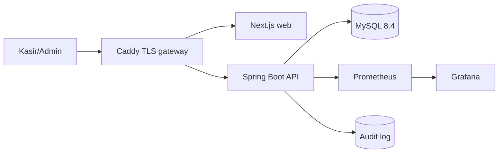
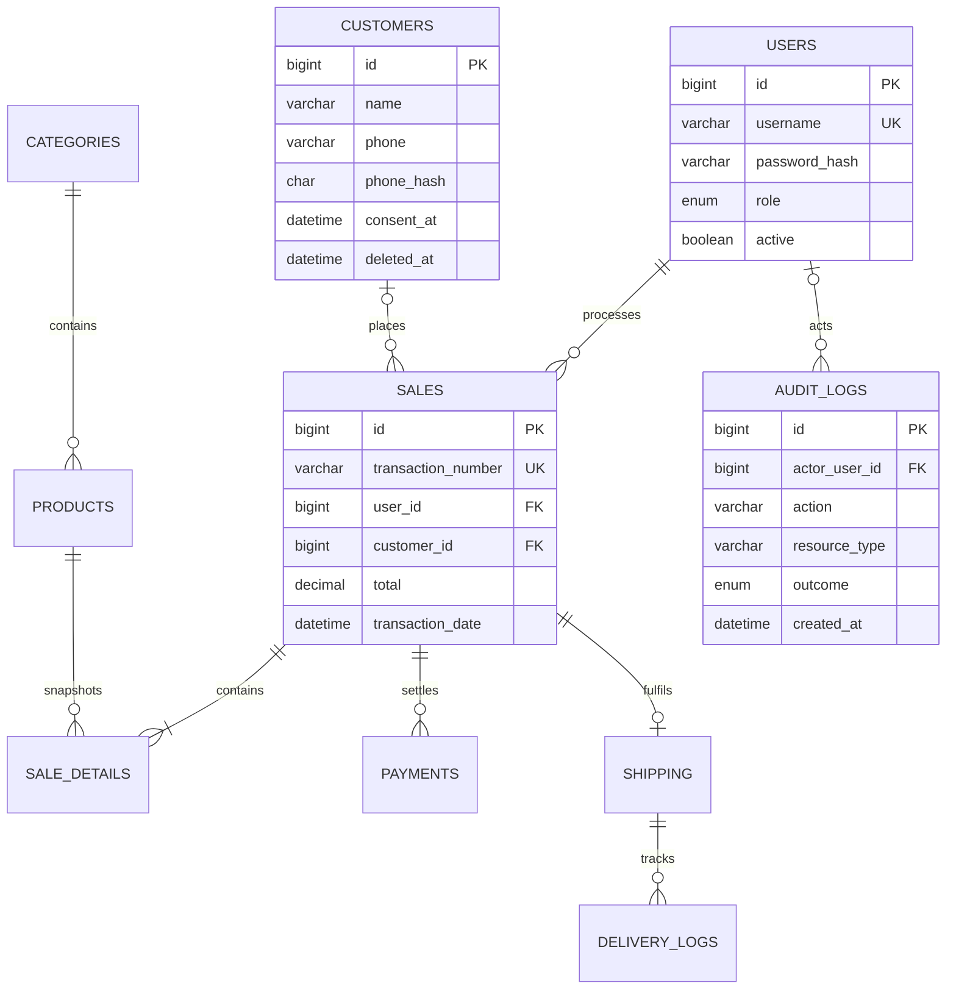
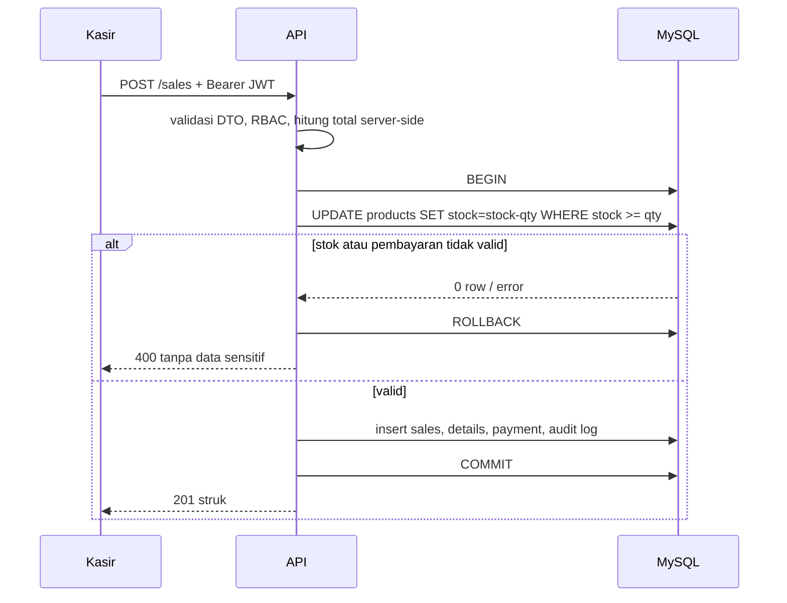

# Arsitektur, LRS, dan pengembangan

Dokumen ini adalah baseline implementasi. Ia tidak menggantikan penilaian hukum, DPIA, atau sertifikasi ISO; pemilik sistem tetap bertanggung jawab atas pengendalian dan bukti pelaksanaannya.

## System design

Prinsipnya: browser hanya berbicara ke origin yang sama; database dan Actuator tidak dipublikasikan. Caddy menjadi satu-satunya ingress. Dalam VPS, aktifkan HTTPS otomatis dengan mengganti `:80` menjadi nama domain pada `Caddyfile`, batasi SSH, dan simpan `.env` hanya di server.

## Logical record structure (LRS)

| Rekaman | Kunci / relasi | Fungsi |
|---|---|---|
| `users` | `id`, `username` unik | akun internal, hash BCrypt, RBAC |
| `customers` | `id`, opsional pada `sales` | PII minimum; consent, hash telepon, penghapusan lunak |
| `categories` → `products` | `products.category_id` | katalog dan stok |
| `sales` → `sale_details` | `sale_details.sale_id` | header transaksi dan snapshot item/harga |
| `sales` → `payments` | `payments.sale_id` | bukti/status pembayaran, bukan data kartu |
| `sales` → `shipping` → `delivery_logs` | FK berantai | fulfilment dan riwayat pengiriman |
| `audit_logs` | actor/resource/waktu | jejak akses dan tindakan penting |

## ERD target

`sale_details.product_name` dan `price` sengaja disimpan sebagai snapshot: perubahan katalog tidak mengubah bukti transaksi historis. Nilai uang memakai `DECIMAL`, bukan float.

## Alur transaksi yang aman

Perbaikan penting: verifikasi stok pada database tetap atomik melalui conditional update. Refactor berikutnya yang disarankan adalah memindahkan seluruh DAO ke repository Spring yang diinjeksi dan memakai satu transaksi Spring; saat ini `SaleDAO` masih mengelola transaksi JDBC sendiri sehingga `@Transactional` pada service bukan sumber transaksi sebenarnya.
