# UMKM Bu Inem CRM & Marketing Architecture

## 1. Architectural Overview

The transformation of **UMKM Bu Inem** expands the software system from an offline/internal-only desktop POS cashier into a comprehensive **Digital Business Platform** integrating:
1. **Public Marketing & Service Discovery**: Dynamic storefront, services catalog, pricing matrix, company profile, and FAQ.
2. **Omnichannel Lead Generation**: Captures inbound interest from contact forms, consultation requests, and service detail inquiries into a centralized CRM pipeline.
3. **Customer Lifecycle Management**: Unified customer tracking spanning initial lead capture, quotation, conversion to customer, and order histories.
4. **Activity & Audit Trail**: Real-time logging of customer interactions, order creation, payment confirmations, and stage transitions.
5. **Dynamic Business Identity**: Database-backed store configuration (`business_settings`) driving receipts, contact information, tax rates, and brand identity without code redeployment.

```mermaid
graph TD
    subgraph "Public Visitor / Customer Facing"
        LandingPage["/ (Homepage)"]
        ServicesCatalog["/services & /services/[slug]"]
        PricingMatrix["/pricing"]
        LeadForm["/contact & Lead Inquiries"]
        OrderCheckout["/order"]
        PaymentGateway["/payment/[orderId] (Cash / QRIS Demo)"]
        ReceiptView["/receipt/[orderId] (58mm Thermal / PDF)"]
    end

    subgraph "Spring Boot 3.4.x API Layer"
        SecurityFilter["SecurityConfig (Public vs Authenticated Filter Chain)"]
        SettingsCtrl["/api/v1/business-settings"]
        ServicesCtrl["/api/v1/services"]
        LeadsCtrl["/api/v1/leads"]
        OrdersCtrl["/api/v1/orders"]
        CrmCtrl["/api/v1/crm"]
    end

    subgraph "Authoritative Business Logic"
        OrderService["OrderService (Server Authoritative Pricing & Tax)"]
        LeadService["LeadService (Kanban Lifecycle & Conversions)"]
        CrmService["CrmService (Customer Unified Timeline & Activity Audit)"]
        SettingsService["BusinessSettingsService (Cache & Identity Provider)"]
    end

    subgraph "Database Layer (Flyway Migrations V1-V8)"
        DB_Settings[("business_settings")]
        DB_Services[("service_products")]
        DB_Leads[("leads")]
        DB_Orders[("orders & order_items")]
        DB_Receipts[("receipts")]
        DB_Activities[("crm_activities")]
        DB_Customers[("customers (Extended)")]
    end

    subgraph "Admin & Staff Management"
        AdminDashboard["/dashboard"]
        LeadsKanban["/leads (Kanban & Table)"]
        OrdersAdmin["/orders (Fulfillment & Status)"]
        CrmTimeline["/activities (Audit Log)"]
        SettingsAdmin["/settings (Live Identity Editor)"]
        LegacyPOS["/pos (Preserved Compatibility Cashier)"]
    end

    LandingPage --> SecurityFilter
    ServicesCatalog --> SecurityFilter
    LeadForm --> SecurityFilter
    OrderCheckout --> SecurityFilter
    PaymentGateway --> SecurityFilter
    ReceiptView --> SecurityFilter

    SecurityFilter --> SettingsCtrl
    SecurityFilter --> ServicesCtrl
    SecurityFilter --> LeadsCtrl
    SecurityFilter --> OrdersCtrl
    SecurityFilter --> CrmCtrl

    SettingsCtrl --> SettingsService
    ServicesCtrl --> OrderService
    LeadsCtrl --> LeadService
    OrdersCtrl --> OrderService
    CrmCtrl --> CrmService

    SettingsService --> DB_Settings
    OrderService --> DB_Services
    OrderService --> DB_Orders
    OrderService --> DB_Receipts
    OrderService --> DB_Activities
    LeadService --> DB_Leads
    CrmService --> DB_Activities
    CrmService --> DB_Customers

    AdminDashboard --> OrdersCtrl
    LeadsKanban --> LeadsCtrl
    OrdersAdmin --> OrdersCtrl
    CrmTimeline --> CrmCtrl
    SettingsAdmin --> SettingsCtrl
    LegacyPOS --> OrdersCtrl
```



---

## 2. Lead Management & Kanban Lifecycle

Leads progress through a defined linear sales funnel represented in both a drag/click Kanban view and a dense data table:

```
[NEW] -> [CONTACTED] -> [QUALIFIED] -> [PROPOSAL] -> [NEGOTIATION] -> [WON] / [LOST]
```

### Stage Definitions:
- **`NEW`**: Inbound lead received via public web form or initial manual entry.
- **`CONTACTED`**: Outreach initiated via WhatsApp or email.
- **`QUALIFIED`**: Verified business requirement, budget fit, and timeline.
- **`PROPOSAL`**: Formal quotation or service proposal submitted.
- **`NEGOTIATION`**: Scope and pricing adjustments in discussion.
- **`WON`**: Successful conversion; triggers lead-to-customer creation.
- **`LOST`**: Discontinued or declined inquiry, capturing reason in activity notes.

---

## 3. CRM Activity & Audit Logging

Every state-altering event records an immutable `crm_activities` record:
- **Activity Types**: `LEAD_CREATED`, `STATUS_CHANGED`, `ORDER_CREATED`, `PAYMENT_INITIATED`, `PAYMENT_CONFIRMED`, `NOTE_ADDED`.
- **Actors**: System automated events (`SYSTEM`), Customer web events (`CUSTOMER_WEB`), or Authenticated Staff/Cashier (`OPERATOR`/`ADMIN`).
- **Entity Linking**: Foreign keys to `customer_id`, `lead_id`, and `order_id` enable multi-perspective activity filtering.
