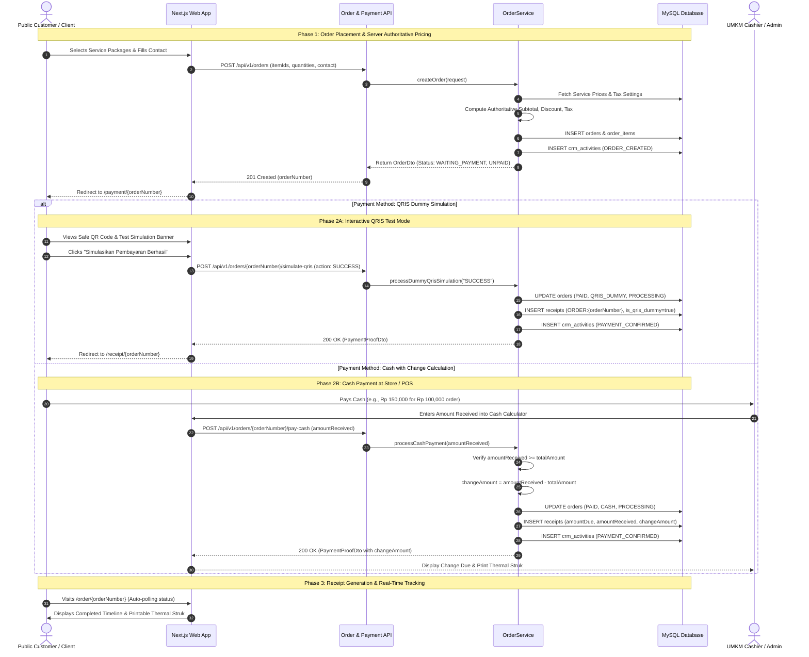

# Order, Authoritative Calculation & Payment Flow

## 1. Authoritative Calculation Principle

To ensure financial integrity and prevent client-side manipulation of prices, discounts, or taxes, **all order totals are calculated exclusively by the backend `OrderService`**.

1. The client sends only the selected `serviceProductId` and `quantity`.
2. `OrderService` looks up active price points (`basePrice`, `finalPrice`) directly from the database snapshot.
3. System calculations:
   $$\text{Line Subtotal} = \text{basePrice} \times \text{quantity}$$
   $$\text{Line Discount} = \max(0, \text{basePrice} - \text{finalPrice}) \times \text{quantity}$$
   $$\text{Subtotal} = \sum \text{Line Subtotal}$$
   $$\text{Total Discount} = \sum \text{Line Discount}$$
   $$\text{Taxable Amount} = \max(0, \text{Subtotal} - \text{Total Discount})$$
   $$\text{Tax Amount} = \text{Round}\left(\text{Taxable Amount} \times \frac{\text{taxRate}}{100}, 2\right)$$
   $$\text{Grand Total} = \text{Taxable Amount} + \text{Tax Amount}$$

Client-submitted subtotals or totals are strictly disregarded.

---

## 2. End-to-End Lifecycle Sequence

---

## 3. Receipt & Barcode Specification

Receipts comply with standard 58mm POS thermal printers as well as responsive web layouts:
- **Receipt Header**: Dynamic store name, address, phone, and CS email from `business_settings`.
- **Order Barcode**: Clean SVG Code 128 barcode rendering payload format `ORDER:{orderNumber}`.
- **Cash Line**: Explicitly breaks down Total Tagihan, Uang Diterima, and Kembalian.
- **QRIS Notice**: If paid via dummy QRIS, displays an explicit banner: `QRIS DEMO / TEST PAYMENT - BUKAN TRANSAKSI PERBANKAN NYATA`.
- **Footer**: Dynamic thank you message from settings.
