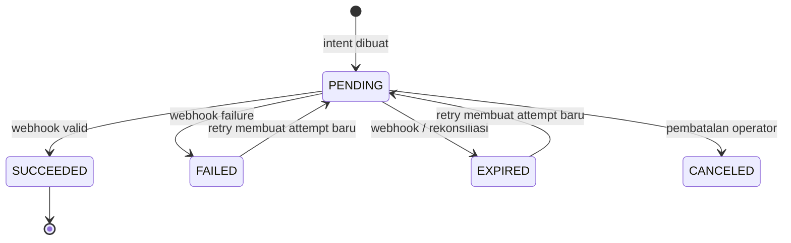

# Integrasi Xendit: QRIS, Virtual Account, dan e-wallet

## Ruang lingkup dan aturan inti

Gunakan Payments API Xendit v3 (`POST /v3/payment_requests`) dengan `type: PAY`, mata uang `IDR`, dan satu `reference_id` unik untuk satu percobaan pembayaran. Secret API key menggunakan Basic Auth hanya dari backend. Nilai `channel_code` tidak boleh diterima bebas dari browser: pilih dari allow-list kanal yang sudah diaktifkan di Dashboard Xendit.

| Pilihan POS | Provider | Output UI |
|---|---|---|
| QRIS dinamis | Xendit QRIS yang aktif | QR string/QR image dari action provider |
| Virtual Account | bank VA yang aktif | nomor VA, instruksi, dan waktu kedaluwarsa |
| E-wallet | DANA, OVO, GoPay, ShopeePay yang aktif | redirect/deeplink/QR dari action provider |

Kanal dan persyaratan dapat berubah menurut aktivasi merchant dan negara; gunakan Channel Data Finder Xendit ketika mengisi mapping konfigurasi, bukan kode hard-coded dari UI. API Xendit memakai Basic Auth dengan secret key sebagai username dan password kosong; environment test tidak menyentuh jaringan perbankan atau menimbulkan biaya.

## Model data dan lifecycle

`payments` menyimpan bukti pembayaran yang berhasil. `payment_attempts` menyimpan setiap intent/retry provider; `payment_webhook_events` menyimpan `webhook-id` unik. Jalankan `V3__xendit_payment_attempts.sql` sesudah V2.



Aturan implementasi:

1. Backend menghitung nominal dari `sales.total`; frontend tidak mengirim nominal final.
2. Simpan `provider_payment_request_id`, `reference_id`, channel, nominal, dan expiry sebelum mengembalikan action QR/redirect ke UI.
3. Endpoint webhook publik hanya memvalidasi token, mencatat `webhook-id`, lalu antre/menyelesaikan update cepat. Jika `webhook-id` sudah ada, balas 2xx tanpa mengubah saldo/stok lagi.
4. Bandingkan `payment_request_id`, `reference_id`, mata uang, dan nominal dengan attempt internal. Abaikan payload yang tidak cocok.
5. Hanya status `SUCCEEDED` dari webhook tervalidasi yang mengubah sale menjadi `PAID`; redirect sukses hanya tampilan, bukan bukti pembayaran.
6. Jangan simpan secret, token kartu, nomor rekening penuh, atau payload PII mentah dalam log/audit.

## Menjalankan lokal

```powershell
Copy-Item .env.example .env
# Isi DB/JWT secret serta XENDIT_SECRET_KEY dan XENDIT_WEBHOOK_TOKEN dari akun Xendit TEST.
docker compose up --build
```

1. Di Xendit Dashboard, pilih **Test mode**, buat secret API key dan verification token webhook.
2. Jalankan tunnel HTTPS menuju API, misalnya `cloudflared tunnel --url http://localhost:8080` bila API dijalankan langsung, atau tunnel ke `http://localhost` dan arahkan webhook ke `https://<subdomain>/api/v1/webhooks/xendit` bila memakai Compose.
3. Daftarkan URL tunnel pada Payment Request webhook settings Xendit. Jangan memakai URL localhost atau token live.
4. Buat intent menggunakan test key, pilih QRIS/VA/e-wallet yang sudah aktif di akun test, lalu gunakan **Simulate payment** pada Dashboard/API Xendit.
5. Verifikasi satu baris `payment_webhook_events`, satu update attempt, dan satu perubahan sale. Kirim ulang webhook yang sama untuk membuktikan idempotensi.

## Checklist sebelum live

- Aktivasi dan kontrak kanal sudah disetujui Xendit; mapping channel diset per environment.
- Domain HTTPS, return URL, dan webhook URL live berbeda dari test.
- `XENDIT_SECRET_KEY` dan `XENDIT_WEBHOOK_TOKEN` ada di secret manager, bukan image/container env yang tercetak log.
- Rekonsiliasi harian: bandingkan payment request/settlement Xendit dengan `payment_attempts` internal.
- Monitor webhook gagal, callback duplikat, attempt pending mendekati expiry, dan mismatch nominal.
